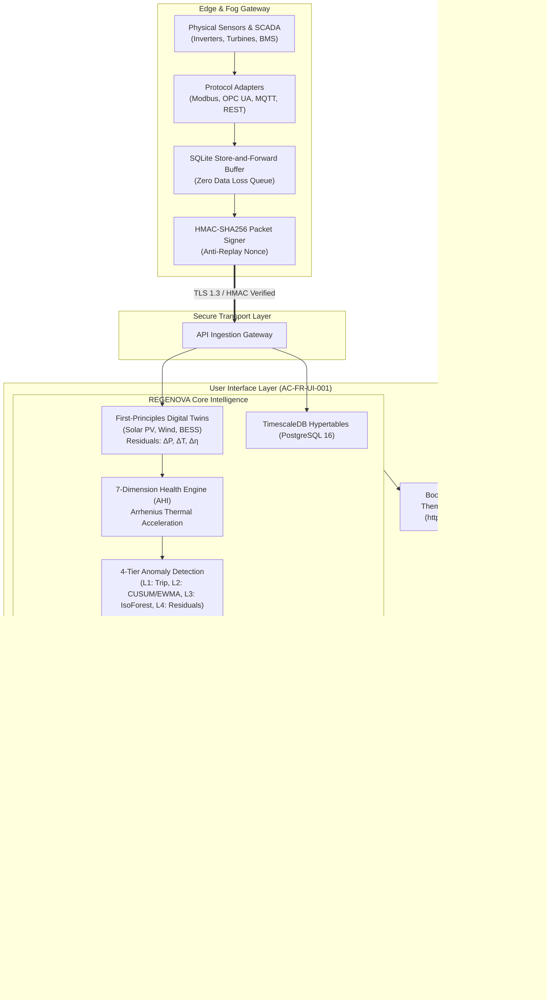

# REGENOVA - Renewable Energy Asset Intelligence & Management Framework

[](https://opensource.org/licenses/MIT)
[](#automated-testing)
[](docs/PHASE_18_REPORT.md)
[](https://getbootstrap.com/)
[](docs/research/evaluation_matrix.md)

> **REGENOVA** (incorporating the **REAMP** — Renewable Energy Asset Intelligence and Management Framework core engine architecture) is an open, research-grade, production-oriented framework for the intelligent management, monitoring, health assessment, anomaly detection, predictive maintenance, and lifecycle optimisation of heterogeneous renewable energy assets.

---

## 1. Executive Overview

Modern renewable generation fleets (Solar PV, Wind, Battery Storage, and co-located Hybrid plants) face severe operational challenges: telemetry loss across remote WAN networks, alarm flood from simplistic static SCADA thresholds, opaque black-box AI models that violate physical laws, and uncalibrated predictive maintenance claims.

**REGENOVA** bridges the gap between first-principles physics and data-driven intelligence. Rather than delivering a simple SCADA dashboard, REGENOVA provides a modular, verifiable software architecture integrating:

- **Edge/Fog Computing**: ACID store-and-forward SQLite buffer guaranteeing zero data loss during WAN link drops with burst-on-anomaly local watchdog;
- **Multi-Technology Physical Pipelines**:
  - **Solar PV**: IEC 61724-1 irradiance/temperature yield modeling and inverter IGBT thermal resistance dissipation ($R_{\text{th}} = 0.08\,^\circ\text{C/kW}$);
  - **Wind Energy**: IEC 61400-12-1 power curve tracking with site-specific barometric air density normalization ($\rho_{\text{site}} = \frac{p \cdot 100}{R \cdot T}$);
  - **BESS (Battery Energy Storage)**: Electrochemical dispatch setpoint tracking, dynamic State-of-Charge boundaries ($5\% \le \text{SoC} \le 95\%$), and cell thermal operational derating;
  - **Hybrid Power Plants**: Multi-technology co-located dispatch behind a shared Point of Interconnection (POI).
- **Deterministic 7-Dimension Health Engine**: Linear-additive Asset Health Index ($AHI \in [0, 100]$) with Arrhenius thermal stress acceleration and full mathematical factor attribution;
- **4-Tier Anomaly Detection Cascade**: Level 1 deterministic safety trip, Level 2 non-parametric statistical control charts (EWMA $\lambda = 0.2$, CUSUM $h = 4.0$), Level 3 multivariate Isolation Forest, and Level 4 physical state residuals ($\Delta P, \Delta T, \Delta\eta$) alongside peer cohort Median Absolute Deviation (MAD);
- **Predictive Maintenance & Quality Gating**: Refuses "fake precision"-extrapolates Remaining Useful Life (RUL) with $95\%$ confidence prediction intervals only when empirical degradation history satisfies $N \ge 5, R^2 \ge 0.70$, otherwise explicitly reporting `status = UNCERTAIN`;
- **CMMS & Work Order Automation**: Automated work order generation with warehouse inventory parts reservation, technician dispatch, and SLA management;
- **Explainable AI (XAI)**: Ranked Shapley Additive Explanations (SHAP) attributing anomaly divergence directly to top sensor contributors (`AC-FR-XAI-001`);
- **Cybersecurity & Trust**: HMAC-SHA256 telemetry packet signing, STRIDE threat mitigation, and an immutable SHA-256 tamper-evident audit ledger;
- **Human-in-the-Loop (HITL) Safety Gating**: Strict $\pm 10.0\%$ guardrail blocking autonomous model drift or high-consequence work orders without two-man cryptographic Chief Engineer authorization;
- **Bootstrap 5.3 Light Theme UI**: Fully responsive, accessible frontend built strictly in Bootstrap 5.3 in Light Theme default (`AC-FR-UI-001`).

---

## 2. Quickstart & Deployment

### 2.1 Launch the Web Application (Bootstrap 5.3 Light Theme)
Start the REGENOVA web server and open the live dashboard in your browser:
```bash
python3 web_server.py 8000
```
Open **[http://localhost:8000](http://localhost:8000)** to view:
- Fleet generation overview and site cards;
- Live Digital Twin with animated SVG gauges and fault injection controls;
- 7-Dimension health progress meters;
- Real-time alarm stream with Acknowledge/Resolve actions;
- Explainable AI (SHAP) ranked feature explanations;
- CMMS HITL work order approval queue;
- Adaptive intelligence $\pm 10\%$ safety interlock;
- Cryptographic SHA-256 audit block explorer.

### 2.2 Run the End-to-End CLI Pipeline Demonstration
Run the 10-stage operational lifecycle in the terminal:
```bash
python3 demo_mvp.py
```

### 2.3 Automated Testing
Execute the complete repository regression test suite:
```bash
python3 -m unittest discover -s tests -p "test_phase*.py" -v
```
All **78/78 tests** pass with 0 failures and 0 errors.

---

## 3. System Architecture



---

## 4. Engineering Roadmap & Phase Completion Status

REGENOVA strictly adheres to a controlled 18-phase development roadmap. All 18 phases have been fully implemented, validated against automated test suites, and audited by an Independent Senior Systems Engineer:

- [x] **Phase 1 - Framework Vision and Requirements** ([`docs/01_Framework_Vision_and_Requirements.md`](docs/01_Framework_Vision_and_Requirements.md))
- [x] **Phase 2 - Asset Ontology and Domain Model** ([`docs/02_Literature_Review.md`](docs/02_Literature_Review.md))
- [x] **Phase 3 - Reference Architecture** ([`docs/03_Architecture_Design.md`](docs/03_Architecture_Design.md))
- [x] **Phase 4 - Data Architecture and Telemetry Model** ([`reamp/data/`](reamp/data/))
- [x] **Phase 5 - Edge, Fog and IoT Integration** ([`reamp/edge/`](reamp/edge/))
- [x] **Phase 6 - Asset Health Model** ([`reamp/health/`](reamp/health/))
- [x] **Phase 7 - Performance Intelligence** ([`reamp/performance/`](reamp/performance/))
- [x] **Phase 8 - Multi-Level Anomaly Detection** ([`reamp/anomaly/`](reamp/anomaly/))
- [x] **Phase 9 - Predictive Maintenance** ([`reamp/maintenance/`](reamp/maintenance/))
- [x] **Phase 10 - O&M and CMMS Integration** ([`reamp/cmms/`](reamp/cmms/))
- [x] **Phase 11 - Risk and Financial Intelligence** ([`reamp/financial/`](reamp/financial/))
- [x] **Phase 12 - Digital Twin and Asset State** ([`reamp/digital_twin/`](reamp/digital_twin/))
- [x] **Phase 13 - Cybersecurity and Trust Framework** ([`reamp/security/`](reamp/security/))
- [x] **Phase 14 - Governance and Explainable Intelligence** ([`reamp/governance/`](reamp/governance/))
- [x] **Phase 15 - MVP Integration** ([`reamp/mvp/`](reamp/mvp/))
- [x] **Phase 16 - Experimental Validation & Benchmarking** ([`benchmarks/`](benchmarks/))
- [x] **Phase 17 - Scalability, Load Testing and Resilience** ([`docs/17_Scalability_and_Resilience.md`](docs/17_Scalability_and_Resilience.md))
- [x] **Phase 18 - Multi-Technology Adaptive REAMP Framework** ([`docs/18_Final_REAMP_Framework.md`](docs/18_Final_REAMP_Framework.md))

---

## 5. Key Documentation Links

- **Capstone Framework Architecture**: [`docs/18_Final_REAMP_Framework.md`](docs/18_Final_REAMP_Framework.md)
- **10 Core Evaluation Questions & Traceability Matrix**: [`docs/research/evaluation_matrix.md`](docs/research/evaluation_matrix.md)
- **Research & Framework Contributions**: [`docs/research/framework_contributions.md`](docs/research/framework_contributions.md)
- **Assumptions, Limitations & Constraints**: [`docs/research/limitations.md`](docs/research/limitations.md)
- **Future Research & Engineering Roadmaps**: [`docs/research/future_work.md`](docs/research/future_work.md)
- **Phase 18 Final Completion Report**: [`docs/PHASE_18_REPORT.md`](docs/PHASE_18_REPORT.md)
- **Acceptance Criteria Specification (`REAMP-REQ-AC-01`)**: [`docs/requirements/acceptance_criteria.md`](docs/requirements/acceptance_criteria.md)

---

## 6. License

Distributed under the **[MIT License](LICENSE)**.
