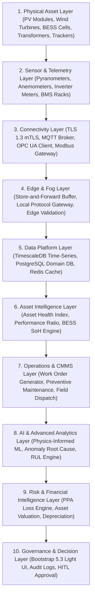
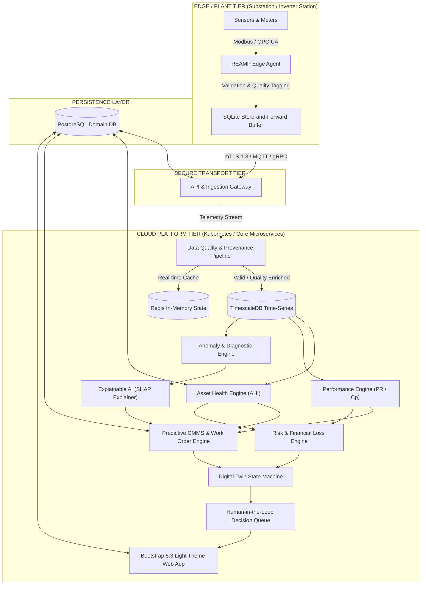

# REAMP - Reference Architecture Specification

**Document Identifier**: `REAMP-DOC-03`  
**Phase**: Phase 3 - Reference Architecture  
**Status**: Approved / Quality Gate Passed  
**Last Updated**: 2026-09-11  

---

## 1. Architectural Philosophy & Principles

The **Renewable Energy Asset Intelligence and Management Framework (REAMP)** Reference Architecture translates the Phase 1 requirements and Phase 2 asset ontology into a modular, production-grade, technology-neutral system design.

In alignment with `AGENTS.md` Rule 5 ("Avoid unnecessary complexity and premature microservices. Use modular architecture first"), REAMP avoids distributed microservice sprawl. Instead, it adopts a **Modular Distributed Hybrid Edge-Cloud Architecture**.

### Key Architectural Principles:
1. **Technology Neutrality**: Decoupled core services using domain adapters for Solar PV, Wind, BESS, and Hybrid plants.
2. **Hybrid Edge-Cloud Partitioning**: Low-latency store-and-forward telemetry ingestion at the Edge; deep analytical intelligence, digital twins, and global user management in the Cloud.
3. **Data Integrity First**: Telemetry is never mutated in-place; quality metadata (`VALID`, `INVALID`, `STALE`) is appended at ingestion time.
4. **Explainable & Audited AI**: 2-step Human-in-the-Loop approval workflows (`Recommendation → Review → Approval → Dispatch`) for all operational actions.
5. **Bootstrap 5.3 Light Theme Standard**: Web presentation relies exclusively on Bootstrap 5.3.x in the default Light Theme.

---

## 2. 10-Layer Reference Architecture Model

REAMP structures all software components into 10 logical layers:



### Layer Responsibilities:
1. **Physical Asset Layer**: Solar PV modules, Wind turbine gearboxes/blades, BESS battery cells/racks, substations.
2. **Sensor/Telemetry Layer**: Transducers, CT/PT meters, thermocouple arrays, vibration sensors, encoders.
3. **Connectivity Layer**: Secure transport protocols (MQTT/TLS 1.3, OPC UA TCP, Modbus TCP, DNP3, REST).
4. **Edge/Fog Layer**: Local IPC gateways running store-and-forward SQLite buffers, local validation, and protocol translation.
5. **Data Platform Layer**: TimescaleDB for time-series telemetry, PostgreSQL for domain entities/relationships, Redis for real-time state caching.
6. **Asset Intelligence Layer**: Core analytical engines ($AHI$, IEC 61724-1 $PR_{STC}$, Wind $C_p$, BESS $SoH$).
7. **Operations/O&M Layer**: CMMS integration adapters, work order dispatch, preventive maintenance rules.
8. **AI/Analytics Layer**: Physics-informed machine learning, multi-variate anomaly detection, SHAP XAI explainers, $RUL$ models.
9. **Risk/Financial Intelligence Layer**: PPA tariff yield loss attribution, asset risk-adjusted valuation, contract penalty tracking.
10. **Governance/Decision Layer**: Human-in-the-Loop approval queue, immutable audit logger, Bootstrap 5.3 Light UI.

### Cross-Cutting Planes:
- **Observability Plane**: OpenTelemetry distributed tracing (W3C trace context), Prometheus metrics exposition (`/metrics`), structured JSON logging (`structlog`), and Kubernetes health probes (`/healthz`, `/readyz`).
- **Cybersecurity & Identity Plane**: OAuth2/OIDC JWT RS256 token verification at API Gateway, X.509 mutual TLS (mTLS 1.3) with internal Device CA for edge gateways, and PostgreSQL Row Level Security (RLS) for strict multi-tenant data isolation.

---

## 3. End-to-End System Architecture Diagram



---

## 4. Trust Boundaries & Security Architecture

REAMP defines 3 strict security zones:

```text
 ┌───────────────────────────┐      ┌───────────────────────────┐      ┌───────────────────────────┐
 │       ZONE 1: EDGE        │      │      ZONE 2: INGESTION    │      │      ZONE 3: CLOUD        │
 │  • Physical Plant Network │ mTLS │  • TLS 1.3 Termination    │ RBAC │  • Tenant Isolated DBs    │
 │  • Edge Store-and-Forward │─────>│  • Token Verification     │─────>│  • Encrypted Data at Rest │
 │  • Local Protocol Mapping │ 1.3  │  • Rate Limiting          │      │  • Immutable Audit Log    │
 └───────────────────────────┘      └───────────────────────────┘      └───────────────────────────┘
```

1. **Zone 1 (Field Edge)**: Isolated industrial SCADA network. Outbound-only mTLS connections to Cloud Ingestion Gateway.
2. **Zone 2 (Ingestion Gateway)**: Demilitarized Zone (DMZ). Performs TLS 1.3 termination, JWT authentication, rate limiting, and schema validation.
3. **Zone 3 (Core Cloud Platform)**: Encrypted internal network. Multi-tenant database schema isolation (`tenant_id` filtering enforced at ORM layer), AES-256 data-at-rest encryption.

---

## 5. Traceability Matrix: Requirements to Architectural Components

| Requirement Category | Phase 1 Requirement IDs | Responsible Architectural Component |
| :--- | :--- | :--- |
| **Asset Hierarchy & Domain** | `FR-AST-001` to `FR-AST-003` | `PostgreSQL Domain DB` / `Domain Model Service` |
| **Ingestion & Edge** | `FR-ING-001` to `FR-ING-003` | `REAMP Edge Agent` / `Ingestion Gateway` |
| **Data Quality** | `FR-DQ-001` to `FR-DQ-003` | `Data Quality & Provenance Pipeline` |
| **Asset Health** | `FR-HLT-001`, `FR-HLT-002` | `Asset Health Engine (AHI)` |
| **Performance Intelligence**| `FR-PRF-001` to `FR-PRF-003` | `Performance Engine (PR / Cp / RTE)` |
| **Anomaly & Diagnostics** | `FR-ANO-001`, `FR-ANO-002` | `Anomaly & Diagnostic Engine` |
| **Predictive Maintenance** | `FR-MAIN-001`, `FR-MAIN-002` | `Predictive CMMS Engine` |
| **Risk & Financial** | `FR-RSK-001`, `FR-RSK-002` | `Risk & Financial Loss Engine` |
| **Digital Twin** | `FR-TWN-001`, `FR-TWN-002` | `Digital Twin State Machine` |
| **Cybersecurity & Tenant** | `FR-SEC-001`, `FR-SEC-002` | `API Gateway` / `RBAC & Audit Logger` |
| **Explainable AI & HITL** | `FR-XAI-001`, `FR-XAI-002` | `XAI SHAP Engine` / `HITL Decision Queue` |
| **Visual Frontend** | `FR-UI-001` to `FR-UI-003` | `Bootstrap 5.3 Light Web App` |

### Non-Functional Requirements (NFR) Traceability Summary

| NFR Category | Phase 1 NFR IDs | Architectural Allocation & Implementation Strategy |
| :--- | :--- | :--- |
| **Availability & Reliability** | `NFR-AVL-001`, `NFR-AVL-002` | Multi-AZ Cloud Kubernetes Pods + Local 72h SQLite Edge Buffer |
| **Scalability & Elasticity** | `NFR-SCL-001`, `NFR-SCL-002` | Ingestion HPA Pod Autoscaling (100k events/s) + TimescaleDB Hypertables |
| **Latency Envelopes** | `NFR-PRF-001` to `NFR-PRF-003` | FastAPI Async I/O ($\le 500\text{ms}$) + Redis Cache ($\le 200\text{ms}$) |
| **Security & Multi-Tenancy** | `NFR-SEC-001` to `NFR-SEC-003` | TLS 1.3/AES-256, PostgreSQL RLS Multi-Tenancy, Secret Managers |
| **Maintainability & Quality** | `NFR-MNT-001`, `NFR-MNT-002` | Clean Architecture (Ports & Adapters), $\ge 80\%$ test coverage |
| **Interoperability** | `NFR-INT-001`, `NFR-INT-002` | OpenAPI 3.0, ProtoBuf3, OpenTelemetry, CMMS REST Webhooks |
| **Observability & Diagnostics**| `NFR-OBS-001`, `NFR-OBS-002` | OpenTelemetry Distributed Tracing, `/healthz` & `/readyz` probes |
| **Portability & Edge Footprint**| `NFR-PRT-001`, `NFR-PRT-002` | Multi-arch OCI containers (`amd64`/`arm64`), $\le 256\text{MB}$ RAM Edge Agent |
| **Resilience & Recovery** | `NFR-RES-001`, `NFR-RES-002` | Exponential backoff edge retry, PostgreSQL Streaming Replication ($\text{RTO} \le 30\text{s}$) |

