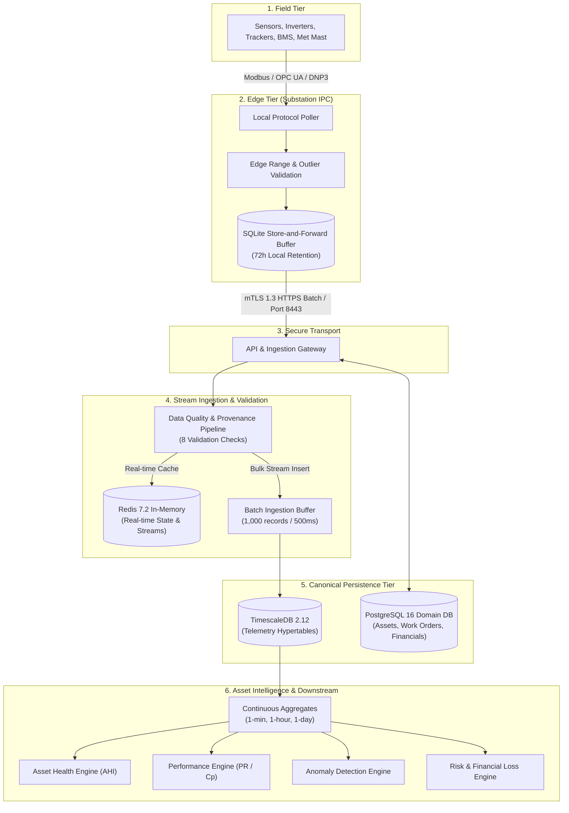

# REAMP — Data Architecture Specification

**Document Identifier**: `REAMP-DOC-04`  
**Phase**: Phase 4 — Data Architecture and Telemetry Model  
**Status**: Approved / Canonical Design  
**Last Updated**: 2026-09-11  

---

## 1. Architectural Principles & Objectives

The **Renewable Energy Asset Intelligence and Management Framework (REAMP)** Data Architecture establishes a rock-solid, production-grade foundation for managing heterogeneous renewable energy telemetry, relational asset metadata, domain events, predictive maintenance work orders, and financial impact analytics.

In compliance with `AGENTS.md` Rule 7 ("Never allow invalid, missing, stale or low-confidence telemetry to be silently treated as trustworthy data"), REAMP treats data quality, temporal provenance, and multi-tenant isolation as core database constraints.

### Core Data Principles:
1. **Append-Only Immutable Telemetry**: High-frequency sensor observations are strictly immutable once ingested. Corrections and quality tags are appended, never destructively mutated in-place.
2. **Explicit Provenance & Confidence**: Every observation encapsulates physical timestamp, ingestion source, validation status (`VALID`, `INVALID`, `MISSING`, `STALE`, `UNCERTAIN`), confidence score ($0.0–1.0$), and communication status.
3. **Storage Tiering by Access Frequency**: Hot real-time state in Redis, high-performance time-series in TimescaleDB hypertables, columnar-compressed historical data in PostgreSQL chunks, and long-term archival in Parquet cold storage.
4. **Enforced Multi-Tenancy via Row Level Security (RLS)**: Corporate tenant isolation is enforced at the database engine level via PostgreSQL RLS policies keyed to `tenant_id`.
5. **Technology-Agnostic Core with Strongly Typed Adapters**: Unified canonical schemas handle Solar PV, Wind Energy, Battery Energy Storage Systems (BESS), and Hybrid plants without schema bifurcation.

---

## 2. End-to-End Data Flow Pipeline



---

## 3. Storage Tiering & Lifecycle Management

To support up to 10,000,000 active sensor channels across 500 plants (`NFR-SCL-002`) while maintaining sub-second query latencies (`NFR-PRF-002`), data storage is organized into 4 distinct tiers:

| Tier | Technology | Retention Period | Target Latency | Data Types Stored | Compression |
| :--- | :--- | :--- | :--- | :--- | :--- |
| **Hot Cache** | Redis 7.2 | 0 to 60 minutes | $< 5\text{ ms}$ | Latest asset state snapshots, active alarms, pub/sub feeds | In-memory RAM |
| **Active Telemetry** | TimescaleDB (Uncompressed) | 1 to 14 days | $< 50\text{ ms}$ | Raw high-frequency (1Hz to 1-min) sensor telemetry | None (Row-oriented) |
| **Warm Historical** | TimescaleDB (Compressed) | 15 to 730 days (2 yrs) | $< 200\text{ ms}$ | Columnar-compressed hypertables, continuous aggregates | Columnar ($\approx 90\%$ compression) |
| **Cold Archival** | S3 / MinIO (Parquet) | $> 2$ years (up to 25 yrs) | $< 5.0\text{ s}$ | Multi-year compliance audits, PPA warranty verification | Snappy / ZSTD Parquet |

---

## 4. TimescaleDB Hypertable Partitioning & Compression

### 4.1 Hypertable Chunk Partitioning
The primary time-series table, `telemetry_observations`, is converted to a TimescaleDB hypertable partitioned by:
1. **Primary Dimension (Time)**: `timestamp TIMESTAMPTZ` with chunk interval set to **7 days** (`chunk_time_interval => INTERVAL '7 days'`).
2. **Secondary Dimension (Space / Hash)**: `tenant_id UUID` with **4 space partitions** for parallel IO distribution across storage disks.

```sql
SELECT create_hypertable(
    'telemetry_observations',
    'timestamp',
    partitioning_column => 'tenant_id',
    number_partitions => 4,
    chunk_time_interval => INTERVAL '7 days',
    if_not_exists => TRUE
);
```

### 4.2 Columnar Compression Policy
Hypertables older than 14 days are automatically converted to columnar compression ordered by `(asset_id, timestamp DESC)` and segmented by `(tenant_id, metric)`. This achieves up to **90% disk space reduction** while accelerating analytical time-range scans:

```sql
ALTER TABLE telemetry_observations SET (
    timescaledb.compress,
    timescaledb.compress_segmentby = 'tenant_id, asset_id, metric',
    timescaledb.compress_orderby = 'timestamp DESC'
);

SELECT add_compression_policy('telemetry_observations', INTERVAL '14 days');
```

### 4.3 Continuous Aggregates
Continuous aggregates materialize downsampled statistics automatically, enabling instant dashboard loading across multi-year historical ranges (`NFR-PRF-002`):

- `telemetry_1min_rollup`: Materializes `count`, `avg`, `min`, `max`, `stddev` per 1-minute bucket.
- `telemetry_1hour_rollup`: Materializes hourly rollups derived from 1-minute views.
- `telemetry_1day_rollup`: Materializes daily yield and operational statistics for billing and degradation analytics.

---

## 5. Multi-Tenant Row Level Security (RLS) Architecture

To enforce strict multi-tenant isolation (`NFR-SEC-002`: "0 cross-tenant data leakage"), REAMP enables PostgreSQL Row Level Security across all 20 data domain tables:

```sql
-- Enable RLS on domain and telemetry tables
ALTER TABLE organisations ENABLE ROW LEVEL SECURITY;
ALTER TABLE portfolios ENABLE ROW LEVEL SECURITY;
ALTER TABLE sites ENABLE ROW LEVEL SECURITY;
ALTER TABLE energy_systems ENABLE ROW LEVEL SECURITY;
ALTER TABLE assets ENABLE ROW LEVEL SECURITY;
ALTER TABLE components ENABLE ROW LEVEL SECURITY;
ALTER TABLE sensors ENABLE ROW LEVEL SECURITY;
ALTER TABLE telemetry_observations ENABLE ROW LEVEL SECURITY;
ALTER TABLE work_orders ENABLE ROW LEVEL SECURITY;
ALTER TABLE audit_logs ENABLE ROW LEVEL SECURITY;

-- Canonical RLS Isolation Policy
CREATE POLICY tenant_isolation_policy ON telemetry_observations
    FOR ALL
    TO authenticated_user
    USING (tenant_id = NULLIF(current_setting('reamp.current_tenant_id', true), '')::UUID)
    WITH CHECK (tenant_id = NULLIF(current_setting('reamp.current_tenant_id', true), '')::UUID);
```

At connection checkout, the API Gateway or ORM session sets the active tenant context:
```sql
SET LOCAL reamp.current_tenant_id = 'a0eebc99-9c0b-4ef8-bb6d-6bb9bd380a11';
```
Any query or insert attempting to touch data outside this tenant is rejected directly by the PostgreSQL engine.

---

## 6. High Availability, Failover & Disaster Recovery

In compliance with `NFR-AVL-001`, `NFR-RES-001`, and `NFR-RES-002`:
1. **Cloud Recovery Objectives**:
   - **Recovery Time Objective (RTO)**: $\le 30\text{ seconds}$ via automated PostgreSQL streaming replication failover (Patroni / PgBouncer).
   - **Recovery Point Objective (RPO)**: $\le 1.0\text{ second}$ via synchronous WAL streaming to standby replicas.
2. **Edge Autonomy**:
   - In the event of complete WAN network partition, edge gateways continue logging locally to SQLite for up to 72 hours without process crashes or telemetry loss.
   - Upon WAN reconnection, buffered records stream to cloud endpoints in ordered batches with checksum verification and transaction acknowledgment.
