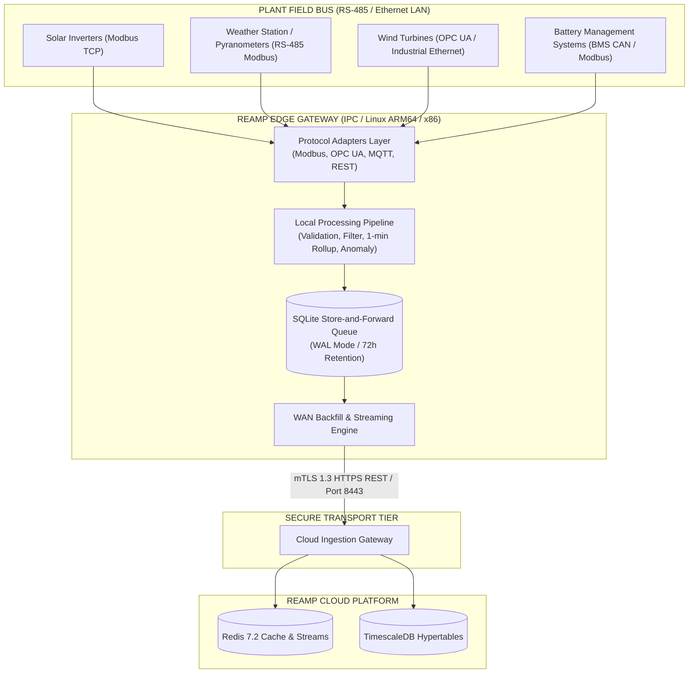

# REAMP — Edge, Fog and IoT Integration Specification

**Document Identifier**: `REAMP-DOC-05`  
**Phase**: Phase 5 — Edge, Fog and IoT Integration  
**Status**: Approved / Implementation Specification  
**Last Updated**: 2026-09-11  

---

## 1. Architectural Role & Principles

The **REAMP Edge Agent** (`reamp/edge-agent`) is the frontline ingestion and control component deployed directly within plant substations, inverter stations, met mast stations, and battery container management units.

In compliance with `AGENTS.md` Rule 7 ("Never allow invalid, missing, stale or low-confidence telemetry to be silently treated as trustworthy data") and Rule 5 ("Modular, testable, secure by design"), the edge layer is designed with the following core principles:

1. **Autonomous Operation**: The edge agent functions completely independently of central cloud availability. It logs, validates, buffers, and executes local safety logic regardless of WAN connection status.
2. **Deterministic Resource Envelope**: Operates within $\le 0.5\text{ CPU cores}$ and $\le 256\text{ MB RAM}$, making it deployable on low-cost ARM64 (Raspberry Pi 4 / CM4, NVIDIA Jetson) and x86 industrial PCs (Siemens Microbox, Advantech UNO).
3. **Store-and-Forward Zero Loss Guarantee**: Telemetry is buffered in local transactional SQLite storage during WAN blackouts for up to 72 hours, automatically synchronizing upon network recovery without data loss or duplication.
4. **Adaptive Bandwidth Optimization**: Under nominal conditions, telemetry is downsampled to 1-minute or 5-minute statistical summaries. When an operational deviation or safety threshold is breached, the agent immediately enters **Burst Mode**, streaming raw 1Hz telemetry.
5. **Local Real-Time Safety Alerting**: Safety-critical thresholds (such as battery runaway temperature or inverter DC overvoltage) trigger immediate local alert outputs without waiting for cloud round-trip latencies.

---

## 2. Hybrid Edge / Cloud Topology

---

## 3. Edge Component Architecture

The Edge Gateway is organized into 5 modular components:

1. **Protocol Adapters (`reamp.edge.adapters`)**: Normalizes disparate industrial protocol payloads (Modbus register maps, OPC UA nodes, MQTT topics, REST endpoints) into canonical `TelemetryObservation` objects with 10 mandatory metadata attributes.
2. **Validation Engine (`reamp.edge.pipeline.ValidationEngine`)**: Evaluates incoming readings against physical limits ($V_{min}, V_{max}$), detects future-dated or drifted timestamps, and identifies signal freezes (stale values).
3. **Aggregation & Throttling Engine (`reamp.edge.pipeline.AggregationEngine`)**: Maintains rolling 1-minute and 5-minute tumbling windows computing `count`, `mean`, `min`, `max`, and `stddev`.
4. **Store-and-Forward Queue (`reamp.edge.buffer.SQLiteEdgeBuffer`)**: Manages the local SQLite database in Write-Ahead Logging (WAL) mode, guaranteeing atomic FIFO queueing and backfill extraction.
5. **Cloud Streaming Client (`reamp.edge.gateway.EdgeGateway`)**: Manages connection state machine, exponential backoff reconnects, mTLS certificate verification, and batch transmission to `POST /api/v1/telemetry/batch`.

---

## 4. Hardware Sizing & Operating Envelope

| Parameter | Specification | Compliance Metric |
| :--- | :--- | :--- |
| **CPU Target** | 4-core ARM64 (Cortex-A72) or x86_64 Dual Core | Average CPU usage $< 25\%$ |
| **Memory Limit** | 256 MB RAM hard limit in container cgroups | Memory footprint $< 120\text{ MB}$ nominal |
| **Storage Engine** | SQLite 3.45+ in WAL mode (`PRAGMA synchronous = NORMAL`) | Flash endurance optimized |
| **Storage Sizing** | 128 GB NVMe or High-Endurance eMMC/Industrial SD | 72 hours of 1Hz data for 500 sensors $\approx 850\text{ MB}$ |
| **Operating System** | Alpine Linux 3.19 or Debian 12 Slim (Linux Kernel $\ge 5.15$) | Read-only root filesystem compatible |
| **Edge Orchestrator** | Lightweight K3s or Docker Compose | Single $< 100\text{ MB}$ container package |
