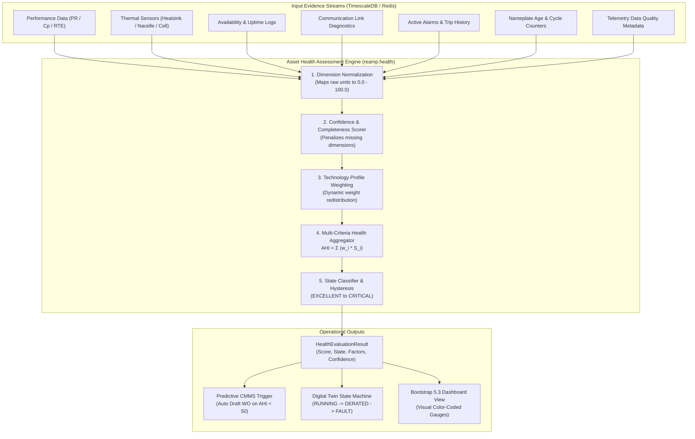

# REAMP - Asset Health Intelligence Framework

**Document Identifier**: `REAMP-DOC-06`  
**Phase**: Phase 6 - Asset Health Model  
**Status**: Approved / Implementation Specification  
**Last Updated**: 2026-09-11  

---

## 1. Executive Overview & Core Principles

In accordance with Phase 6 instructions (*"Develop the first formal Asset Health Assessment Engine. Do not introduce machine learning yet unless justified. Do not assume fixed weights are universally valid"*), the **REAMP Asset Health Intelligence Framework** establishes a deterministic, multi-criteria condition scoring methodology for renewable energy infrastructure.

Rather than relying on opaque black-box deep learning models, REAMP structures asset health into an **explainable composite index** ($AHI \in [0.0, 100.0]$) that evaluates physical operating stress, efficiency losses, thermal degradation, fault occurrences, and data availability.

### Core Architectural Principles:
1. **Explainability by Design (`AGENTS.md` Rule 8)**: Every health assessment computes exact fractional contributions from each dimension, ensuring operators understand *why* an asset's score changed.
2. **Technology Adaptability**: Weights and thresholds are decoupled from the core algorithm and parameterized into technology profiles for Solar PV, Wind Energy, and Battery Energy Storage Systems (BESS).
3. **Data Integrity & Confidence Awareness (`AGENTS.md` Rule 7)**: Low-confidence, stale, or missing telemetry automatically penalizes the assessment confidence score ($0.0–1.0$) rather than silently skewing health results.
4. **Deterministic Reproducibility**: Given an identical set of telemetry observations and configuration profile, the engine produces identical, bitwise-reproducible health scores.
5. **Actionable Operational Outputs**: Health state transitions directly trigger CMMS work orders (`reamp.cmms`), derating recommendations, or digital twin operational state updates.

---

## 2. Multi-Dimensional Health Assessment Architecture

---

## 3. The 7 Candidate Health Dimensions

The engine evaluates 7 independent dimensions of operational condition:

| # | Dimension | Symbol | Physical Basis & Candidate Metrics | Target Failure Modes |
| :- | :--- | :---: | :--- | :--- |
| 1 | **Performance** | $S_{perf}$ | IEC 61724-1 $PR_{STC}$, Wind $C_p$, BESS Round-Trip Efficiency ($RTE$) | Soiling, module mismatch, blade aerodynamic stall, battery capacity fade |
| 2 | **Thermal Stress** | $S_{therm}$ | Inverter heatsink temperature, transformer oil temp, BESS max cell temp | IGBT junction degradation, cooling fan failure, thermal runaway risk |
| 3 | **Availability** | $S_{avail}$ | Operational uptime ratio over 30-day sliding window | Grid curtailment, inverter trips, balance-of-plant outages |
| 4 | **Communication** | $S_{comm}$ | Heartbeat latency, edge buffer backfill frequency, packet drop rate | Field bus noise, cellular antenna fade, gateway hardware lockups |
| 5 | **Fault History** | $S_{fault}$ | Severity-weighted frequency of alarms over last 7 days | Chronic intermittent tripping, contactor wear, insulation leakage |
| 6 | **Degradation** | $S_{deg}$ | Calendar age vs design lifespan, cumulative equivalent full cycles ($EFC$) | Photovoltaic cell LID/PID, gearbox bearing fatigue, battery SEI layer growth |
| 7 | **Sensor Quality** | $S_{dq}$ | Percentage of `VALID` vs `INVALID`/`STALE` observations, confidence | Pyranometer drift, thermocouple detachment, transducer calibration loss |

---

## 4. Confidence Scoring & Missing Data Handling

A critical defect in naive health models is treating missing telemetry as either 0 (which drastically crashes the health score) or omitting it silently (which masks sensor failures).

REAMP solves this via a **Two-Layer Confidence and Weight Redistribution Model**:

1. **Available Dimension Evaluation**:
   If a telemetry dimension is missing or completely unconfigured for an asset, the engine redistributes its weight proportionally across all remaining available dimensions:
   $$w_i^* = \frac{w_i}{\sum_{k \in \text{Available}} w_k}$$
2. **Confidence Penalty**:
   The overall evaluation confidence $C_{eval} \in [0.0, 1.0]$ is penalized according to the importance of the missing dimensions and the quality of the available data:
   $$C_{eval} = \left( \sum_{k \in \text{Available}} w_k \right) \times \left( \frac{1}{|\text{Available}|} \sum_{k \in \text{Available}} c_k \right)$$
   Where $c_k$ is the data quality confidence score of dimension $k$.

If $C_{eval} < 0.50$, the health state is explicitly flagged as `UNCERTAIN / INSUFFICIENT_TELEMETRY`, alerting operators that physical condition cannot be safely determined.
