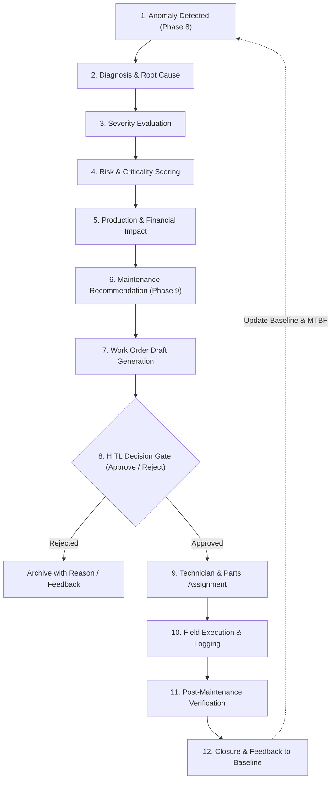

# REAMP Phase 10 — Operations & Maintenance (O&M) and CMMS Integration Framework

## 1. Executive Summary & Framework Mission

In industrial renewable energy generation (Solar PV, Wind, BESS, and Hybrid microgrids), detected anomalies and algorithmic degradation models are inert unless seamlessly translated into governed, physical maintenance actions. 

The **REAMP Operations & Maintenance (O&M) and Computerized Maintenance Management System (CMMS) Integration Framework** closes the operational loop between telemetry-driven condition intelligence and field technician execution.

Rather than functioning as a passive reporting dashboard, REAMP establishes an auditable, deterministic, 12-stage closed-loop maintenance lifecycle:
$$\text{Anomaly} \to \text{Diagnosis} \to \text{Severity} \to \text{Risk} \to \text{Production Impact} \to \text{Recommendation} \to \text{Work Order} \to \text{Assignment} \to \text{Execution} \to \text{Verification} \to \text{Closure} \to \text{Feedback}$$

### Core Tenets of REAMP O&M Architecture:
1. **Safety & HITL Governance (`AGENTS.md` Rule 8)**: AI/ML diagnostics and predictive models generate actionable recommendations and draft work orders, but **must never silently execute consequential physical maintenance actions**. Consequential actions (dispatching high-voltage technicians, swapping inverters, taking assets offline) require explicit, authenticated human approval.
2. **Deterministic Traceability (`Quality Gate`)**: Complete unbroken audit lineage from the underlying raw telemetry anomaly through human decision-making, physical dispatch, parts replacement, and post-intervention health verification:
   $$\text{Asset} \to \text{Anomaly} \to \text{Decision} \to \text{Work Order} \to \text{Action} \to \text{Result}$$
3. **Multi-Paradigm Maintenance Orchestration**: Unifies Corrective Maintenance (CM), Preventive Maintenance (PM), Condition-Based Maintenance (CBM), and Predictive Maintenance (PdM) with rigorous inspection logging.
4. **Physical Asset Resource Management**: Real-time management of technician qualifications, parts inventory allocation, downtime and generation loss tracking, and warranty claim linkage.

---

## 2. The 12-Stage Closed-Loop Maintenance Lifecycle



| Stage | Stage Name | Description & Inputs | Primary Actors / Modules |
| :--- | :--- | :--- | :--- |
| **1** | **Anomaly** | Multi-level anomaly detection (statistical, rule, physical residual, or Isolation Forest). | `reamp.anomaly` |
| **2** | **Diagnosis** | Root-cause classification and affected component localization. | Anomaly Engine / Diagnostics |
| **3** | **Severity** | Technical classification of degradation (CRITICAL, MAJOR, MINOR, INFO). | Health / Anomaly Engine |
| **4** | **Risk** | Multi-criteria risk scoring ($P1 \dots P4$) with emergency safety override. | `reamp.maintenance.priority` |
| **5** | **Production Impact**| Quantified expected energy loss (kWh/MWh) and financial impact (USD/EUR). | `reamp.performance`, Loss Attribution |
| **6** | **Recommendation** | Prescriptive action formulation, required skills, spare parts, and time window. | `reamp.maintenance.engine` |
| **7** | **Work Order Draft**| Conversion of incident and recommendation into a structured CMMS Work Order. | `reamp.cmms.workflow` |
| **8** | **HITL Decision Gate**| Mandatory human authorization (Chief Engineer / O&M Director) prior to dispatch. | **Human Operator (HITL Gating)** |
| **9** | **Assignment** | Qualified technician allocation matching skill requirements and parts reservation. | `reamp.cmms.inventory`, Scheduler |
| **10**| **Execution** | On-site physical intervention, time tracking, safety checklists, parts consumption. | Field Technician / CMMS Agent |
| **11**| **Verification** | Automated post-repair telemetry evaluation verifying anomaly clearance. | `reamp.cmms.workflow`, Telemetry |
| **12**| **Closure & Feedback**| Formal sign-off, warranty claim generation, baseline health restoration, MTBF update. | CMMS Orchestrator, Asset Registry |

---

## 3. Human-in-the-Loop (HITL) Safety Architecture

Renewable energy sites encompass medium-to-high-voltage substations, battery energy storage systems (BESS) subject to thermal runaway risks, and multi-megawatt wind turbines. Fully automated dispatch introduces critical safety hazards, unnecessary truck rolls, and operational disruptions.

### HITL Safety Gating Rules:
1. **Default Status**: Every work order automatically initialized from an algorithmic recommendation defaults to `PENDING_HITL_APPROVAL`.
2. **Dispatch Barrier**: The workflow engine strictly prohibits dispatch or execution transitions if the work order status is not `APPROVED`. Attempting to dispatch an unapproved order raises an explicit `PermissionError`.
3. **Audit Trail**: Every approval or rejection records:
   - `approved_by` (User ID / Operator Name);
   - `decision_timestamp` (ISO 8601 UTC);
   - `decision_comments` / `rejection_reason`;
   - `modified_scope` (if the human engineer adjusted the scope, parts, or priority).

---

## 4. End-to-End Traceability Architecture

To meet compliance requirements (IEC 62443, ISO 55000 asset management standards, and utility power purchase agreements), REAMP enforces immutable traceability. Every work order maintains a `TraceabilityRecord`:

```
Asset ID: INV-WEST-01
 └── Anomaly: ANOM-20260911-0042 (Inverter IGBT Overheating Delta-T > 18°C)
      └── Decision: DEC-20260911-8812 (Chief Engineer Approval: Replace Cooling Fan & Thermal Paste)
           └── Work Order: WO-2026-00109 (Priority: P2_HIGH, Assigned: Tech-JohnDoe, Spares: FAN-48V-DC)
                └── Action: ACT-2026-00441 (Executed: Fan replaced, heat sink cleaned, 1.5h labor)
                     └── Result: RES-2026-00301 (Verified: Post-repair Delta-T = 2.4°C, Health restored 52 -> 98)
```

If an asset fails prematurely or incurs lost production, operators can inspect the exact historical chain of detection, human review, parts consumed, and post-repair validation.

---

## 5. Maintenance Paradigms Supported

1. **Corrective Maintenance (CM)**:
   - Triggered by unplanned trips, inverter lockouts, or safety threshold breaches.
   - Immediate triage ($P1$ or $P2$ priority), tracking downtime minutes and generation loss.
2. **Condition-Based Maintenance (CBM)**:
   - Triggered when continuous health scoring degrades below warning thresholds (e.g., $HI < 70$).
   - Scheduled within 48 to 72 hours before acute failure occurs.
3. **Predictive Maintenance (PdM)**:
   - Trajectory-driven, based on RUL forecasts ($RUL < 30 \text{ days}$, conditional Weibull probability).
   - Planned weeks in advance to align with low-irradiance windows or scheduled grid outages.
4. **Preventive Maintenance (PM) & Inspections**:
   - Time- or cycle-based scheduled tasks (annual inverter torque checks, quarterly drone thermography, monthly battery balance testing).
   - Generates inspection records tracking component wear patterns over time.

---

## 6. Downtime, Inventory & Warranty Management

### Downtime Accounting
- **Operational Downtime**: Asset unavailable due to fault or physical maintenance.
- **Lost Generation**:
  $$\text{Energy Loss (kWh)} = \int_{t_{\text{start}}}^{t_{\text{end}}} P_{\text{expected}}(t) \, dt$$
- **Financial Impact**:
  $$\text{Revenue Loss} = \text{Energy Loss} \times \text{Tariff} + \text{Contractual Penalties}$$

### Spare Parts & Inventory
- Real-time stock tracking with explicit location, lead time, unit cost, and reorder point alerts.
- Automated parts reservation during work order drafting and permanent deduction upon execution closure.

### Warranty Claims
- Automated lookup against asset and component warranty records during corrective work order creation.
- Automatically generates warranty claim packages if an asset fails within warranty duration, recovering labor and component costs from OEMs.
