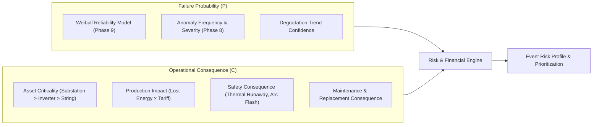

# REAMP Phase 11 — Risk and Financial Intelligence Framework

## 1. Executive Summary & Framework Mission

In renewable energy asset operations (Solar PV, Wind, BESS, and Hybrid systems), pure technical condition indicators (e.g. an anomaly score of $0.82$, an IGBT temperature of $89^\circ\text{C}$, or a health index drop to $64$) are insufficient for executive decision-making. 

Asset managers, plant operators, and off-takers require technical conditions to be translated into **quantified operational and financial consequences**.

The **REAMP Risk and Financial Intelligence Framework** bridges the gap between engineering diagnostics and financial decision support:
$$\text{Technical Severity} \implies \text{Operational Consequence} \implies \text{Energy Loss (kWh)} \implies \text{Financial Impact (\$) } \implies \text{Actionable Priority}$$

Crucially, the framework adheres to two non-negotiable principles:
1. **Evidence-Based Financials (`No Fake Pricing`)**: Energy market tariffs, PPA rates, and operational penalties are **never fabricated or hardcoded**. All financial calculations operate on explicitly configured `FinancialAssumptions` and document all applied assumptions in the resulting audit trail.
2. **Explainable Asset Prioritization (`Phase 11 Quality Gate`)**: Operational resources are finite. When the system ranks multiple assets for intervention, operators must be provided with an intuitive, mathematically grounded explanation detailing *why* an asset was prioritized over others.

---

## 2. Core Risk Formulation

The conceptual risk model is formulated as:
$$\text{Risk} = \text{Probability} \times \text{Consequence}$$



### 2.1 Probability ($P \in [0.0, 1.0]$)
- Derived from conditional Weibull survival analysis $P_f(t, \Delta t) = 1 - \exp\left( -\left(\frac{t + \Delta t}{\eta}\right)^\beta + \left(\frac{t}{\eta}\right)^\beta \right)$ developed in Phase 9, combined with multi-level anomaly confidence from Phase 8.
- Penalized when telemetry confidence or evidence sufficiency is incomplete (ensuring no false precision).

### 2.2 Consequence ($C \in [0.0, 100.0]$)
The multi-dimensional consequence is a weighted combination of four normalized impact vectors:
$$C = w_{\text{prod}} C_{\text{prod}} + w_{\text{crit}} C_{\text{crit}} + w_{\text{safe}} C_{\text{safe}} + w_{\text{maint}} C_{\text{maint}}$$

| Vector | Factor Description | Weight ($w$) | Measurement Basis |
| :--- | :--- | :--- | :--- |
| **$C_{\text{prod}}$** | **Production Impact** | $0.35$ | Normalized expected monetary revenue loss over the failure horizon. |
| **$C_{\text{crit}}$** | **Asset Criticality** | $0.25$ | Topo-functional hierarchy (Substation/Interconnect: 100, Inverter: 75, String: 25). |
| **$C_{\text{safe}}$** | **Safety Consequence** | $0.25$ | Physical personnel and environmental hazard (Arc flash, fire, runaway). |
| **$C_{\text{maint}}$** | **Maintenance Consequence** | $0.15$ | Spares lead time, crane mobilization, specialized high-voltage labor. |

### 2.3 Safety Override Gate
If $C_{\text{safe}} \ge 85.0$ (e.g. BESS cell temperature runaway or high-voltage insulator breakdown), the composite risk score immediately escalates to **`EXTREME`**, overriding purely economic or probability considerations.

---

## 3. Financial Loss Quantification Model

Where data and assumptions permit, the framework models total financial exposure ($L_{\text{total}}$) as:
$$L_{\text{total}} = L_{\text{energy}} + L_{\text{downtime}} + L_{\text{maint}} + L_{\text{repl}}$$

### 3.1 Lost Energy Valuation ($L_{\text{energy}}$)
$$L_{\text{energy}} = E_{\text{lost}} \times V_{\text{energy}}$$
where:
- $E_{\text{lost}} = \int_{0}^{T_{\text{horizon}}} \left[ P_{\text{expected}}(t) - P_{\text{actual}}(t) \right] dt$ (calculated using IEC 61724-1 irradiance-normalized reference yield from Phase 7).
- $V_{\text{energy}}$ is the configured tariff ($\$/\text{kWh}$ or $€/\text{MWh}$) defined in `FinancialAssumptions`.

### 3.2 Downtime & Contractual Penalties ($L_{\text{downtime}}$)
$$L_{\text{downtime}} = T_{\text{down}} \times \text{Pen}_{\text{hourly}} + \text{CapacityShortfallPenalties}$$
Accounts for grid connection availability guarantees, PPA minimum uptime obligations, and capacity market derating penalties.

### 3.3 Direct Maintenance Costs ($L_{\text{maint}}$)
$$L_{\text{maint}} = (\text{Labor Hours} \times \text{Hourly Rate}) + \text{Spare Parts Catalog Cost} + \text{Logistics / Mobilization}$$
Tracks consumable components and certified technician rates from the CMMS (Phase 10).

### 3.4 Catastrophic Replacement Risk ($L_{\text{repl}}$)
$$L_{\text{repl}} = P_f \times (\text{Asset Capital Replacement Cost} - \text{Salvage Value})$$
Quantifies the financial exposure if an early degradation condition is allowed to progress into complete catastrophic destruction (e.g., gearbox seizure in a wind turbine or full inverter cabinet fire).

---

## 4. Required Event Output Schema

For each significant operational event, the engine produces an immutable `EventRiskProfile`:

```json
{
  "event_id": "EVT-2026-9011",
  "asset_id": "INV-WEST-01",
  "technical_severity": "MAJOR",
  "operational_consequence": "Inverter derated by 35% due to IGBT thermal dissipation failure",
  "estimated_energy_loss_kwh": 1420.0,
  "estimated_financial_impact_usd": 248.50,
  "financial_breakdown": {
    "energy_revenue_loss_usd": 170.40,
    "downtime_penalty_usd": 0.00,
    "maintenance_cost_usd": 78.10,
    "catastrophic_replacement_risk_usd": 0.00
  },
  "composite_risk_score": 78.4,
  "risk_tier": "HIGH",
  "confidence": 0.92,
  "assumptions": {
    "energy_tariff_usd_per_kwh": 0.12,
    "technician_hourly_rate_usd": 90.00,
    "projection_horizon_hours": 48.0,
    "irradiance_profile": "Clear-sky diurnally weighted"
  }
}
```

---

## 5. Explainability Architecture (Quality Gate)

To satisfy the Phase 11 Quality Gate:
> *"A user must be able to understand why an asset has been prioritised."*

The engine implements `explain_prioritization(asset_id, fleet_context)`:
1. **Mathematical Attribution**: Breaks down exact point contributions from failure probability, energy loss revenue, criticality, and safety.
2. **Natural Language Rationale**: Synthesizes a transparent operational explanation (e.g. *"Asset INV-WEST-01 was prioritized #1 across 24 fleet inverters primarily due to acute generation loss ($248.50/day) during high summer irradiance, combined with high probability of complete IGBT failure within 48 hours."*).
3. **Comparative Context**: Details why this asset outranks competing assets with similar anomaly scores.
