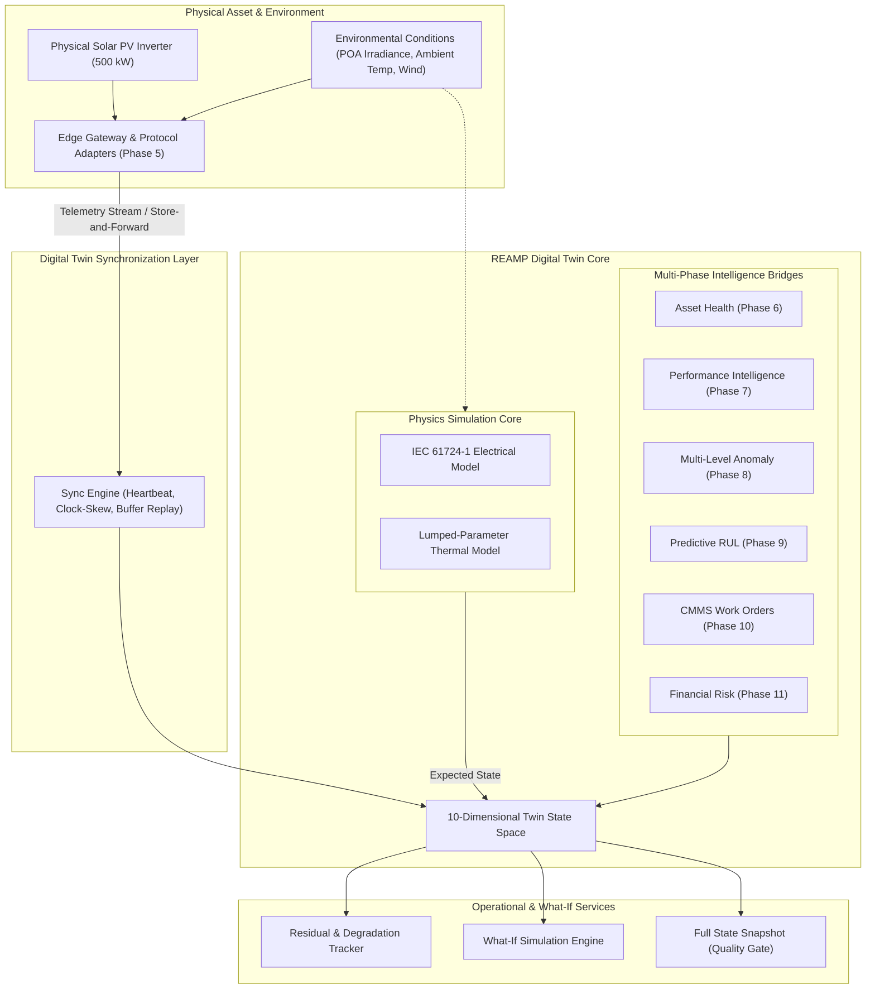

# REAMP Phase 12 — Digital Twin and Asset State Framework

## 1. Executive Summary & Twin Philosophy

A persistent deficiency in industrial asset management frameworks is the tendency to conflate a relational database record or telemetry historian tag with a "Digital Twin". A static database row containing nameplate ratings or a time-series table of historical power measurements is **not** a digital twin.

In REAMP, a **Digital Twin** is an active, synchronized, computational software replica of an operating physical asset that:
1. Maintains real-time synchronization with the physical entity across heterogeneous operational modes;
2. Runs an internal first-principles physical and engineering model in parallel with incoming telemetry to continuously compute the **Expected State** ($S_{\text{expected}}$) under ambient environmental conditions;
3. Continuously measures **State Residuals** ($\Delta S = S_{\text{actual}} - S_{\text{expected}}$) to detect emergent mechanical, electrical, and thermal degradations before threshold-based alarms trigger;
4. Unifies ten dimensions of asset knowledge: Identity, Configuration, Current State, Historical State, Expected State, Health, Performance, Anomalies, Maintenance, and Predicted Trajectories;
5. Provides **Forward Simulation and What-If Analysis** capabilities, allowing operators and algorithms to explore hypothetical operating scenarios (e.g. ambient heatwaves, component failures, or maintenance deferral) without jeopardizing physical equipment.

---

## 2. Digital Twin Architecture & Scope

---

## 3. The 10 Dimensions of the REAMP Digital Twin State Space

To deliver a comprehensive operational representation, the digital twin explicitly encapsulates ten distinct dimensions:

| Dimension | Description | Implementation Source |
| :--- | :--- | :--- |
| **1. Identity** | Asset UUID, serial number, plant topology, subsystem hierarchy, geographical coordinate. | `TwinIdentity`, Asset Registry |
| **2. Configuration** | Nameplate ratings, DC/AC voltage limits, MPPT specs, thermal resistance, derating curves. | `InverterConfiguration` |
| **3. Current State** | Live observed telemetry: $P_{\text{actual}}, V_{\text{dc}}, I_{\text{dc}}, V_{\text{ac}}, I_{\text{ac}}, T_{\text{heatsink}}$, operating mode, alarms. | Telemetry Ingestion / Modbus |
| **4. Historical State** | Time-series buffer of past operational observations, state transitions, and cumulative operating hours. | In-Memory Sliding Buffer / TimescaleDB |
| **5. Expected State** | Simulated nominal physics-based values: $P_{\text{expected}}, T_{\text{expected}}, \eta_{\text{expected}}$ under real-time weather. | Internal Physics Engine |
| **6. Health State** | Continuous health index $HI \in [0, 100]$ and subcomponent health scores (Capacitors, IGBT, Fans). | `reamp.health` (Phase 6) |
| **7. Performance State**| Performance Ratio (PR), temperature derating loss, clipping loss, availability. | `reamp.performance` (Phase 7) |
| **8. Anomaly State** | Active detected anomalies, detector model, severity, root cause classifications. | `reamp.anomaly` (Phase 8) |
| **9. Maintenance State**| Active CMMS work orders, assigned technicians, reserved spare parts, historical downtime. | `reamp.cmms` (Phase 10) |
| **10. Predicted State** | Remaining Useful Life (RUL) point and confidence interval, 30-day failure probability, risk tier. | `reamp.maintenance` (Phase 9), `reamp.risk` (Phase 11) |

---

## 4. Physics-Based Expected State & Residual Tracking

Rather than relying purely on empirical black-box machine learning, the REAMP digital twin embeds physical first principles:

### 4.1 Electrical Expected Power ($P_{\text{expected}}$)
$$P_{\text{dc,expected}} = P_{\text{dc,rated}} \times \left(\frac{G_{\text{poa}}}{1000}\right) \times \left[1 + \gamma_{\text{temp}} (T_{\text{cell}} - 25)\right]$$
$$P_{\text{ac,expected}} = \min\left(P_{\text{ac,rated}}, \, P_{\text{dc,expected}} \times \eta_{\text{inv}}(P_{\text{dc,expected}})\right)$$
where:
- $G_{\text{poa}}$ is plane-of-array irradiance ($\text{W/m}^2$);
- $\gamma_{\text{temp}}$ is the temperature coefficient of power ($\%/^\circ\text{C}$);
- $\eta_{\text{inv}}$ is the empirical European/CEC inverter efficiency curve.

### 4.2 Thermal Expected Heatsink Temperature ($T_{\text{heatsink,expected}}$)
Modeled via a lumped-parameter thermal model:
$$T_{\text{heatsink,expected}} = T_{\text{ambient}} + P_{\text{loss}} \times R_{\text{th}}$$
$$P_{\text{loss}} = P_{\text{dc}} - P_{\text{ac}} = P_{\text{ac}} \times \left(\frac{1 - \eta}{\eta}\right)$$
where $R_{\text{th}}$ ($^\circ\text{C/kW}$) is the effective thermal resistance of the heatsink and cooling subsystem.

### 4.3 State Residuals
$$\Delta P = P_{\text{actual}} - P_{\text{expected}}$$
$$\Delta T = T_{\text{heatsink,actual}} - T_{\text{heatsink,expected}}$$
A persistent positive temperature residual ($\Delta T > +10^\circ\text{C}$) under normal electrical load is a deterministic early indicator of fan bearing wear or heatsink dust clogging weeks before a high-temperature threshold alarm is breached.

---

## 5. Forward Simulation & What-If Analysis

The digital twin functions as an experimental sandbox enabling operators to execute forward simulations without risking physical hardware:

1. **Ambient Climate Stress ("Heatwave Scenario")**:
   - Operator tests: *"What happens if ambient temperature rises to $45^\circ\text{C}$ for 4 hours at peak irradiance ($1000\text{ W/m}^2$)?"*
   - Digital twin predicts: Expected heatsink temperature rises to $94.2^\circ\text{C}$, triggering a $22\%$ automatic inverter thermal curtailment ($110\text{ kW}$ generation loss, $\$66.00$ revenue loss).
2. **Cooling Subsystem Degradation ("Fan Failure Scenario")**:
   - Operator tests: *"What if the secondary cooling fan seizes completely?"*
   - Digital twin doubles thermal resistance $R_{\text{th}}$, predicting an internal thermal trip within $42\text{ minutes}$ under current irradiance.
3. **Deferred Maintenance Scenario**:
   - Operator tests: *"What if inverter capacitor replacement is postponed by 30 days?"*
   - Digital twin evaluates RUL trajectory, predicting an increase in conditional failure probability from $12\%$ to $48\%$, with a $65\%$ chance of unplanned trip during peak summer generation.
