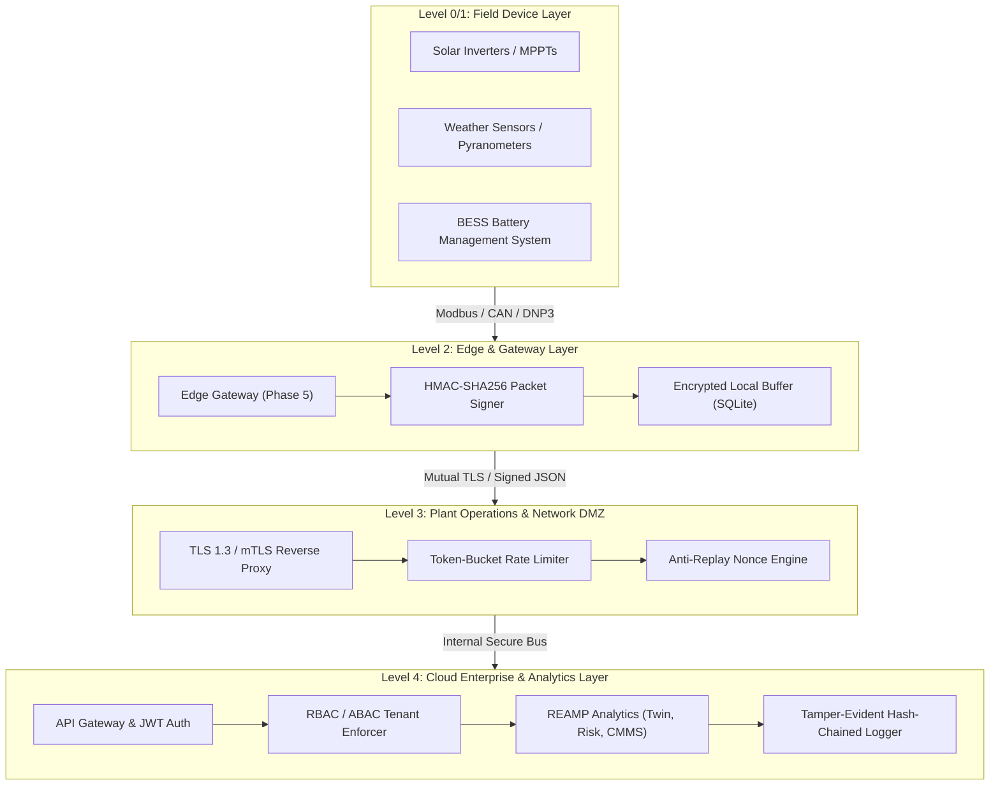

# REAMP Phase 13 - Cybersecurity and Trust Framework

## 1. Executive Summary & Philosophy

Renewable Energy Asset Management systems manage Critical National Infrastructure (CNI). Unlike generic IT enterprise software, cyber-physical renewable energy systems control multi-megawatt high-voltage substations, battery energy storage systems (BESS) subject to thermal runaway, and multi-asset grid interconnects.

A cyber incident in REAMP can directly induce physical destruction, catastrophic equipment damage, severe personnel hazards, or wide-area grid instability.

Therefore, the **REAMP Cybersecurity and Trust Framework** enforces three foundational philosophies:
1. **Defense-in-Depth Across All Layers**: Security is not a perimeter firewall or an isolated authentication gate. Security controls are embedded across Device, Edge, Network, API, Cloud, and User layers.
2. **Zero Trust Architecture (ZTA)**: Never trust, always verify. Every telemetry packet, internal RPC invocation, and supervisory dispatch request must be explicitly authenticated, authorized, and cryptographically verified regardless of network origin.
3. **Data Trust Beyond Raw Availability**: High-confidence renewable asset management requires distinguishing five distinct dimensions of data trust: **Confidentiality, Integrity, Availability, Authenticity, and Provenance**.

---

## 2. Architectural Layering (Purdue Model / IEC 62443 Alignment)

---

## 3. Defense-in-Depth Controls Across Layers

### 3.1 Device & Edge Layer (Level 0–2)
- **Cryptographic Packet Signing**: Every telemetry packet generated at the edge is signed using an HMAC-SHA256 key unique to the physical device.
- **Replay Protection**: Packets include an ISO UTC timestamp and a monotonic unique nonce. Any packet with a timestamp skew $> 30\text{ seconds}$ or an already observed nonce is rejected.
- **Store-and-Forward Encryption**: Edge SQLite cache stores telemetry encrypted using AES-256-GCM.

### 3.2 Network & Protocol Layer (Level 3)
- **Encrypted Transits**: All communication over external networks enforces TLS 1.3 with forward secrecy.
- **Network Segmentation**: Supervisory control channels are physically or logically segregated from monitoring and telemetry collection channels (IEC 62443 conduits).
- **Rate Limiting & DoS Defense**: Ingress endpoints enforce token-bucket rate limiting per IP and client certificate to mitigate denial-of-service floods.

### 3.3 API & Cloud Layer (Level 4)
- **Cryptographic Identity & JWT**: Users and system services authenticate via short-lived HMAC-signed tokens with explicit tenant claims.
- **Tenant Isolation (ABAC)**: Every query and database transaction enforces strict tenant boundaries; cross-tenant operations are rejected at the application boundary and backed by PostgreSQL Row Level Security (RLS).
- **Human-in-the-Loop Authorization Gating**: Consequential actions (such as dispatching field technicians or executing maintenance) strictly require privileged roles (`CHIEF_ENGINEER` or `SECURITY_ADMIN`) and throw `PermissionError` if unapproved.

### 3.4 Governance & Audit Layer
- **Tamper-Evident Hash-Chained Audit Trail**: All administrative and operational actions are committed to an immutable append-only hash chain:
  $$H_i = \text{SHA-256}(H_{i-1} \parallel \text{Entry}_i)$$
  Any attempt to modify or delete a historical audit log breaks the cryptographic chain and triggers an alert.
