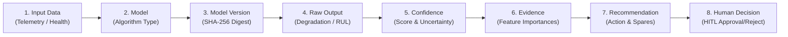
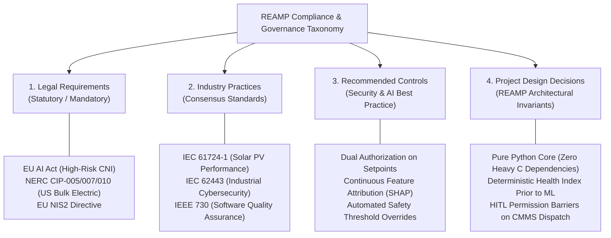

# REAMP Phase 14 — Governance, Compliance and Explainability Framework

## 1. Executive Summary & Governance Mission

Artificial Intelligence and Machine Learning in renewable energy operations are not merely analytical conveniences; they influence multi-million dollar asset dispatch, predictive maintenance scheduling, and personnel safety in high-voltage environments.

The **REAMP Governance, Compliance and Explainability Framework** establishes the supervisory, regulatory, and explainable foundation required to transition AI from speculative experimentation into trustworthy, auditable, enterprise-grade operations.

In strict accordance with `AGENTS.md` Rule 8 (AI Safety and Explainability) and the Phase 14 specifications:
1. **Explainable AI Decision Lineage**: Every algorithmic recommendation must be fully auditable from raw sensor input to human authorization:
   $$\text{Input Data} \to \text{Model} \to \text{Model Version} \to \text{Output} \to \text{Confidence} \to \text{Evidence} \to \text{Recommendation} \to \text{Human Decision}$$
2. **Data Provenance & Cryptographic Lineage**: Unbroken graph tracing intermediate transformations, filtering, and model inferences back to certified device telemetry.
3. **Model & Algorithm Lifecycle Governance**: Formal registration, algorithm categorization, hyperparameter logging, and SHA-256 binary/weight digest verification.
4. **Configuration Change Auditing**: Complete historical traceability for modifications to plant safety thresholds, PPA financial assumptions, and detector parameters.
5. **Categorized Regulatory Compliance**: Transparent classification of compliance baselines into Legal Requirements, Industry Practices, Recommended Controls, and Project Design Decisions.

---

## 2. The 8-Stage Canonical AI Decision Record

| Stage | Field Name | Description & Regulatory Role |
| :--- | :--- | :--- |
| **1** | **Input Data** | Summary of ingested telemetry, time window, and data quality bitmasks. |
| **2** | **Model** | Model identity and functional domain (`reamp-cbm-inverter-thermal`, `reamp-rul-weibull`). |
| **3** | **Model Version** | Semantic versioning (`v1.4.2`) and immutable SHA-256 cryptographic weight digest. |
| **4** | **Raw Output** | Mathematical output of the model (e.g. failure probability $P_f = 0.78$, $RUL = 720\text{h}$). |
| **5** | **Confidence** | Quantified prediction confidence ($0.92$) and explicit uncertainty bounds. |
| **6** | **Evidence** | Mathematical factor attribution (e.g. Heatsink Temp: $48\%$, DC Current: $32\%$, Ambient: $20\%$). |
| **7** | **Recommendation** | Prescriptive action formulation, required skills, spare parts, and time window. |
| **8** | **Human Decision** | Explicit human sign-off (`APPROVED`, `REJECTED`, `MODIFIED`), operator ID, timestamp, and notes. |

---

## 3. Categorized Regulatory & Compliance Architecture

In compliance with the mandate:
> *"Identify applicable legal, regulatory and industry requirements based on the deployment jurisdiction. Do not invent compliance claims. Clearly distinguish legal requirement, industry practice, recommended control, project design decision."*

### 3.1 Legal Requirements (Statutory Mandates)
- **EU Artificial Intelligence Act (Regulation 2024/1689)**: Classifies AI used in safety components of critical infrastructure (energy grids) as **High-Risk AI Systems** (Annex III). Mandates human oversight (Article 14), accuracy/robustness (Article 15), technical documentation (Article 11), and record-keeping (Article 12).
- **NERC CIP (North American Electric Reliability Corporation Critical Infrastructure Protection)**: Standards CIP-005 (Electronic Security Perimeter), CIP-007 (System Security Management), CIP-010 (Configuration Change Management & Verification) for bulk electric systems.
- **EU NIS2 Directive (Directive 2022/2555)**: Mandates incident logging, supply chain security, and risk analysis for essential energy entities.

### 3.2 Industry Practices (Consensus Standards)
- **IEC 61724-1**: Photovoltaic system performance monitoring guidelines and temperature compensation.
- **IEC 62443**: Security for industrial automation and control systems (Zones, Conduits, Security Levels 1-3).
- **ISO 55000 / 55001**: Asset management management systems requirements and lifecycle tracking.

### 3.3 Recommended Controls (Operational Best Practices)
- Dual-operator authorization for high-voltage setpoint modifications.
- Continuous mathematical feature attribution (e.g. SHAP values) on anomaly scoring.
- Automated emergency safety overrides bypassing economic optimization when personnel safety is threatened.

### 3.4 Project Design Decisions (Architectural Invariants)
- **Pure Python 3.12 Core**: Zero heavy binary C compilation dependencies (`scipy`/`sklearn` avoided), ensuring predictable runtime deployment on resource-constrained edge gateways.
- **Deterministic Health First**: Physical and statistical rules precede stochastic ML models.
- **Strict HITL Barrier**: Unapproved draft work orders raise `PermissionError` at runtime.
