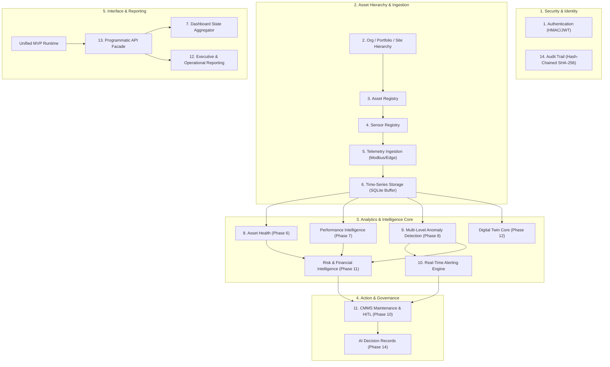

# REAMP Phase 15 — MVP Integration Architecture

## 1. Executive Summary & Objective

The objective of Phase 15 is to synthesize the individual, research-grade framework modules developed across Phases 1 through 14 into a **Coherent, Production-Grade Minimum Viable Product (MVP)**.

The MVP does not rely on mock placeholders or speculative microservices. It integrates the actual deterministic physical models, statistical filters, pure-Python Isolation Forest detectors, Weibull RUL calculators, CMMS state machines, risk prioritizers, digital twin engines, cryptographic security managers, and governance audit chains into a unified application runtime: `reamp.mvp.orchestrator.REAMPApplicationMVP`.

Using a utility-scale Solar PV plant as the first complete reference technology, the MVP maintains technology-neutral abstractions to support subsequent Wind, BESS, and Hybrid renewable energy systems.

---

## 2. The 14 Required Integrated Capabilities

The REAMP MVP integrates all 14 required capabilities:



| # | MVP Capability | Module Reference | Operational Function |
| :--- | :--- | :--- | :--- |
| **1** | **Authentication** | `reamp.security.auth.AuthenticationManager` | HMAC-signed API tokens, device signatures, replay protection. |
| **2** | **Org / Portfolio / Site** | `reamp.mvp.models.Organization` | Multi-tenant administrative and plant topological hierarchy. |
| **3** | **Asset Registry** | `reamp.mvp.models.AssetRecord` | Central inventory of generation assets with nameplate specs. |
| **4** | **Sensor Registry** | `reamp.mvp.models.SensorRecord` | Inventory of telemetry sensors (pyranometer, thermocouple, inverter). |
| **5** | **Telemetry Ingestion** | `reamp.edge.modbus`, `reamp.security.auth` | Ingestion, validation, and cryptographic signing of edge packets. |
| **6** | **Time-Series Storage** | `reamp.edge.storage.EdgeGatewayBuffer` | Persistent storage with SQLite buffering and store-and-forward. |
| **7** | **Dashboard API** | `reamp.mvp.api.REAMPAppAPI` | JSON aggregation of plant generation, health, alerts, and work orders. |
| **8** | **Asset Health** | `reamp.health.deterministic` | Deterministic composite and component health index ($HI \in [0, 100]$). |
| **9** | **Anomaly Detection** | `reamp.anomaly.engine.MultiLevelAnomalyEngine` | L1 rules, L2 statistical (EWMA/CUSUM), L3 Isolation Forest, L4 residuals. |
| **10**| **Alerting System** | `reamp.mvp.orchestrator.AlertManager` | Automated notification dispatch with deduplication and acknowledgment. |
| **11**| **Maintenance & CMMS**| `reamp.cmms.workflow.CMMSWorkflowEngine` | Closed-loop 12-stage work orders with mandatory HITL approval gating. |
| **12**| **Reporting Engine** | `reamp.mvp.orchestrator.generate_executive_report` | Automated Markdown/JSON executive performance, loss, and audit reports. |
| **13**| **Unified API Facade** | `reamp.mvp.api.REAMPAppAPI` | Programmatic entrypoint for external SCADA and operator clients. |
| **14**| **Audit Trail** | `reamp.security.audit.TamperEvidentAuditLogger` | Append-only cryptographic SHA-256 hash chaining ($H_i = \text{SHA256}$). |

---

## 3. The 10-Stage Integration Pipeline

The MVP demonstrates an unbroken end-to-end operational pipeline connecting field physics to executive decisions:

$$\text{Sensor} \to \text{Gateway} \to \text{Ingestion} \to \text{Storage} \to \text{Analytics} \to \text{Health} \to \text{Anomaly} \to \text{Alert} \to \text{Maintenance} \to \text{Report}$$

```
1. Sensor: Pyranometer reads 850 W/m² POA; Inverter PT100 reads 78°C heatsink.
    ↓
2. Gateway: Edge node bundles readings into structured Modbus/CAN telemetry payload.
    ↓
3. Ingestion: Gateway signs payload with device HMAC-SHA256 key; Ingestion validates nonce and clock skew.
    ↓
4. Storage: Packet committed to local SQLite buffer and replicated to central time-series store.
    ↓
5. Analytics: Digital Twin executes IEC 61724-1 model; computes expected heatsink temp (54°C), detecting ΔT = +24°C residual.
    ↓
6. Health: Deterministic Health Engine derates Inverter Health Index from 95.0 to 62.0 (Cooling sub-health: 48.0).
    ↓
7. Anomaly: L2 CUSUM and L4 Physical Residual engines confirm acute thermal dissipation failure.
    ↓
8. Alert: Real-Time Alerting Engine fires Alert ALT-001 (CRITICAL: Inverter IGBT Overheating Hazard).
    ↓
9. Maintenance: Predictive Engine prescribes cooling fan replacement; CMMS drafts Work Order WO-0042 (PENDING_HITL).
    ↓
10. Report: Executive Reporting compiles generation losses ($340.00), avoided catastrophic cost ($15,000), and audit lineage.
```
