# REAMP - Renewable Energy Asset Intelligence and Management Framework

## Final Capstone Architecture Document (Phase 18)

---

## 1. Executive Summary & Vision

The **Renewable Energy Asset Intelligence and Management Framework (REAMP)** is a production-oriented, research-grade, modular software architecture designed for heterogeneous utility-scale and distributed renewable-energy assets. 

Moving beyond traditional Supervisory Control and Data Acquisition (SCADA) dashboards, REAMP unifies:
- Edge/fog store-and-forward telemetry buffering with guaranteed offline data integrity;
- Multi-technology physical performance intelligence (Solar PV, Wind Turbines, Battery Energy Storage Systems [BESS], and co-located Hybrid power plants);
- Multi-dimensional deterministic asset health scoring (IEC 61724-1, IEC 61400-12-1, Arrhenius thermal acceleration);
- Multi-tier physics-informed and statistical anomaly detection (Levels 1–4: deterministic trip, EWMA/CUSUM statistical drift, multivariate Isolation Forest, physical residual tracking);
- Predictive maintenance and remaining useful life (RUL) estimation with explicit uncertainty refusal;
- Computerized Maintenance Management System (CMMS) dispatch with automated work order generation;
- First-principles digital twins with real-time state residual tracking and what-if simulation;
- Financial risk, revenue loss attribution, and PPA tariff loss modeling;
- STRIDE-compliant cybersecurity, HMAC telemetry signing, and cryptographic SHA-256 tamper-evident audit ledgers;
- Human-in-the-Loop (HITL) safety gating on high-consequence actions and algorithmic parameter shifts;
- Closed-loop adaptive intelligence controlling autonomous operational feedback.

Following the non-negotiable engineering philosophy established in `AGENTS.md`:
$$\text{simple} \longrightarrow \text{modular} \longrightarrow \text{observable} \longrightarrow \text{testable} \longrightarrow \text{extensible}$$
REAMP rejects black-box opacity and fake precision, providing mathematically auditable factor attribution across all analytical stages.

---

## 2. End-to-End System Architecture

```mermaid
flowchart TB
    subgraph EdgeFog["Edge & Fog Layer (On-Site Gateway)"]
        Sensors["Physical Sensors & SCADA\n(Inverters, Turbines, BMS, Weather)"]
        Protocols["Protocol Adapters\n(Modbus TCP, OPC UA, MQTT, REST)"]
        DataQualEdge["Edge Data Quality Engine\n(Range, Freeze, Delta, Confidence)"]
        SQLiteBuf["SQLite Store-and-Forward Buffer\n(ACID Persistence, FIFO Sync)"]
        HMACSigner["HMAC-SHA256 Packet Signer\n(Device Key & Anti-Replay Nonce)"]
        EdgeWatchdog["Edge Local Anomaly Watchdog\n(Critical Trip & Burst-on-Anomaly)"]

        Sensors --> Protocols
        Protocols --> DataQualEdge
        DataQualEdge --> SQLiteBuf
        SQLiteBuf --> HMACSigner
        DataQualEdge --> EdgeWatchdog
    end

    subgraph Transport["Secure Transport Layer"]
        HMACSigner ==>|"TLS 1.3 / HMAC Verified\nBatch / Burst Sync"| IngestionGateway
    end

    subgraph CloudCore["Cloud Core Intelligence Layer"]
        IngestionGateway["API & Telemetry Ingestion Gateway\n(Token Auth, HMAC Verify, Deduplication)"]
        
        subgraph Storage["Persistent Storage & Ledger"]
            PostgresTS["PostgreSQL 16 + TimescaleDB\n(Multi-Tenant Hypertables, RLS)"]
            AuditLedger["Cryptographic SHA-256 Audit Ledger\n(Tamper-Evident Hash Chain)"]
        end

        subgraph TwinLayer["Digital Twin & Physics Engines"]
            DigitalTwin["First-Principles Digital Twins\n(Solar PV, Wind, BESS)\nResiduals: ΔP, ΔT, Δη"]
            PhysicsPerf["Performance Intelligence Models\n(IEC 61724-1, IEC 61400-12-1, BMS)"]
        end

        subgraph Analytics["Diagnostic & Prognostic Pipelines"]
            HealthEngine["7-Dimension Health Engine\n(Perf, Thermal, Avail, Comm, Fault, Degr, Sensor)"]
            AnomalyEngine["4-Level Anomaly Detection\n(L1: Threshold/Trip, L2: EWMA/CUSUM,\nL3: IsoForest, L4: Peer MAD & Physics)"]
            PdMEngine["Predictive Maintenance & RUL\n(Exponential/Linear Degradation, Quality Gate)"]
            RiskEngine["Financial Risk & Revenue Loss\n(PPA Tariff, Penalty Accrual, VaR)"]
        end

        subgraph AdaptiveControl["Closed-Loop Adaptive Engine"]
            LoopController["8-Stage Closed-Loop Controller\n(Observe -> Validate -> Assess -> Detect ->\nPredict -> Decide -> Act -> Observe Again)"]
            AdaptiveCalib["Controlled Adaptive Intelligence\n(Seasonal Thresholds, Soiling Multiplier)"]
            HITLGuard["HITL Safety Guardrail\n(Strict Rejection if Shift > 10%)"]
        end

        subgraph MaintenanceGov["Maintenance & Operational Governance"]
            CMMS["CMMS Maintenance Orchestrator\n(Work Orders, SLA Tracking, Inventory)"]
            HITLApprover["Chief Engineer HITL Console\n(Work Order & Model Adaptation Approval)"]
        end

        IngestionGateway --> PostgresTS
        IngestionGateway --> DigitalTwin
        IngestionGateway --> PhysicsPerf
        
        DigitalTwin --> HealthEngine
        PhysicsPerf --> HealthEngine
        HealthEngine --> AnomalyEngine
        AnomalyEngine --> PdMEngine
        PdMEngine --> RiskEngine
        
        RiskEngine --> LoopController
        LoopController --> CMMS
        LoopController --> AdaptiveCalib
        AdaptiveCalib --> HITLGuard
        HITLGuard --> HITLApprover
        HITLApprover --> AuditLedger
        CMMS --> AuditLedger
    end
```



---

## 3. Element Categorization Matrix

To maximize reusability across heterogeneous renewable power plants while preserving specialized domain physics, REAMP strictly partitions components into four architectural tiers:

| Tier | Characteristics | REAMP Framework Elements |
| :--- | :--- | :--- |
| **Technology-Independent** | Core abstractions, transport protocols, operational workflows, and data stores that apply identically regardless of asset physics. | • Edge Store-and-Forward Buffer (`SQLiteEdgeBuffer`)<br>• Protocol Parsing Abstractions (`Modbus`, `OPC UA`, `MQTT`, `REST`)<br>• Data Quality Validation Framework (Null, Range, Freeze, Confidence scoring)<br>• Multi-Tenant Domain Hierarchy (`Organization`, `Portfolio`, `Site`, `Asset`, `Sensor`)<br>• TimescaleDB Schema & Row Level Security (RLS)<br>• Cryptographic SHA-256 Audit Ledger (`TamperEvidentAuditLogger`)<br>• Role-Based Access Control (`SecurityToken`, `SecurityRole`, `Permission`)<br>• CMMS Work Order Lifecycle & SLA Management<br>• Alert Dispatching & Deduplication Engine<br>• Revenue Loss & PPA Tariff Financial Modeling |
| **Technology-Specific** | Deep physical, electrochemical, and aerodynamic equations governed by specific engineering standards. | • **Solar PV**: IEC 61724-1 temperature-derated yield, POA irradiance models, inverter IGBT thermal resistance model, module degradation rate.<br>• **Wind Turbine**: IEC 61400-12-1 empirical power curves, air density barometric corrections ($\rho = \frac{p \cdot M}{R \cdot T}$), gearbox and main bearing thermal envelopes, pitch/yaw stress.<br>• **BESS**: Electrochemical Round-Trip Efficiency (RTE), State-of-Charge (SoC) operating boundaries ($5\% - 95\%$), cell maximum thermal envelope ($15^\circ\text{C} - 35^\circ\text{C}$ optimum), lithium plating thermal derating.<br>• **Hybrid Power Plant**: Co-located multi-technology dispatch arbitration and aggregated substation headroom tracking. |
| **Configurable** | Operational thresholds, baseline constants, and tuning parameters adapted per site without code modifications. | • Anomaly detection thresholds ($Z$-score sigma, EWMA $\lambda$, CUSUM $h$ and $k$, Isolation Forest contamination $\nu$)<br>• Alert severity triggers and deduplication time windows ($300\text{s}$)<br>• Edge sync batch sizes and retry backoff policies<br>• P1–P4 Priority Risk Matrix weighting factors<br>• PPA tariff rates per kWh ($0.05 - 0.15\text{ USD}$) and penalty clauses<br>• Health dimension weight distributions ($w_1 \dots w_7$) |
| **Extensible** | Abstract base classes and interfaces designed for third-party microservices, new assets, or novel algorithms. | • `BasePerformanceModel`: Plug-in interface for emerging technologies (e.g., Geothermal, Green Hydrogen electrolyzers, Ocean Wave).<br>• `BaseAnomalyDetector`: Framework for integrating specialized deep-learning models (e.g., Autoencoders, Graph Neural Networks).<br>• `ProtocolAdapter`: Interface for specialized industrial protocols (e.g., DNP3, IEC 61850).<br>• `BaseCMMSConnector`: Connector for enterprise enterprise software (e.g., SAP PM, IBM Maximo). |

---

## 4. Multi-Technology Reference Pipelines

REAMP provides four reference operational pipelines validated under full integration testing:

### 4.1 Solar PV Reference Pipeline
- **Physics Engine**: Implements IEC 61724-1 temperature-compensated expected AC power:
  $$P_{\text{ac, expected}} = P_{\text{rated, dc}} \cdot \left(\frac{G_{\text{POA}}}{G_{\text{STC}}}\right) \cdot \left[1 + \gamma (T_{\text{cell}} - 25)\right] \cdot \eta_{\text{inv}}$$
- **Thermal Residual**: Digital twin models thermal dissipation through IGBT heatsink thermal resistance ($R_{\text{th}} = 0.08\,^\circ\text{C/kW}$):
  $$T_{\text{hs, expected}} = T_{\text{ambient}} + (P_{\text{dc}} - P_{\text{ac}}) \cdot R_{\text{th}}$$
  A residual $\Delta T_{\text{hs}} > 15\,^\circ\text{C}$ flags cooling fan failure or filter clogging.
- **Health Profile**: `SOLAR_PV_INVERTER_PROFILE` evaluating DC/AC conversion efficiency, thermal stress, IGBT switching health, and pyranometer sensor quality.

### 4.2 Wind Turbine Reference Pipeline
- **Physics Engine**: Implements IEC 61400-12-1 aerodynamic power curve with site-specific air density normalization:
  $$\rho_{\text{site}} = \frac{P_{\text{baro}} \cdot 100}{R_{\text{specific}} \cdot (T_{\text{ambient}} + 273.15)}, \quad v_{\text{norm}} = v_{\text{measured}} \cdot \left(\frac{\rho_{\text{site}}}{\rho_0}\right)^{\frac{1}{3}}$$
- **Drivetrain Monitoring**: Drivetrain gearbox and main bearing temperature thresholds prevent catastrophic mechanical seizure.
- **Health Profile**: `WIND_TURBINE_PROFILE` tracking blade aerodynamic roughness, gearbox mechanical vibration/temperature, generator winding thermal stress, and yaw alignment accuracy.

### 4.3 Battery Energy Storage System (BESS) Reference Pipeline
- **Physics Engine**: Electrochemical charge/discharge dispatch setpoint tracking constrained by dynamic SoC boundaries:
  $$\text{SoC}_{\text{min}} = 0.05 \le \text{SoC}(t) \le \text{SoC}_{\text{max}} = 0.95$$
- **Thermal Envelope**: Stringent operational envelope ($15^\circ\text{C} \le T_{\text{cell}} \le 35^\circ\text{C}$). Low-temperature plating derate ($< 5^\circ\text{C}$) and high-temperature thermal runaway derate ($> 40^\circ\text{C}$) protect battery lifecycle.
- **Health Profile**: `BESS_BATTERY_PROFILE` evaluating round-trip efficiency (RTE), capacity fade, cell temperature variance, and BMS communication integrity.

### 4.4 Co-located Hybrid Power Plant Pipeline
- **Co-located Architecture**: Solar PV inverters, Wind Turbines, and BESS containers co-located behind a shared Point of Interconnection (POI).
- **Dispatch Arbitration**: Enables dynamic curtailment smoothing: BESS absorbs excess wind/solar generation exceeding grid capacity constraints ($P_{\text{export}} > P_{\text{POI, max}}$) and discharges during low resource or high tariff intervals.
- **Unified Health Rollup**: Site-level health score dynamically aggregates heterogeneous assets weighted by rated capacity.

---

## 5. The Closed Feedback Loop

Operational excellence requires that diagnosis directly drives audited action, and that the effect of every action is verified through continuous observation. REAMP realizes this via an unbroken 8-stage closed feedback cycle:

$$\text{Stage 1: Observe} \longrightarrow \text{Stage 2: Validate} \longrightarrow \text{Stage 3: Assess} \longrightarrow \text{Stage 4: Detect} \longrightarrow \text{Stage 5: Predict} \longrightarrow \text{Stage 6: Decide} \longrightarrow \text{Stage 7: Act} \longrightarrow \text{Stage 8: Observe Feedback}$$

```
                +-------------------------------------------------+
                |               1. OBSERVE                        |
                |   Ingest multi-sensor telemetry packet          |
                +-----------------------+-------------------------+
                                        |
                                        v
                +-------------------------------------------------+
                |               2. VALIDATE                       |
                |   Quality rules, confidence scoring, freshness  |
                +-----------------------+-------------------------+
                                        |
                                        v
                +-------------------------------------------------+
                |               3. ASSESS                         |
                |   7-dimension deterministic health index        |
                +-----------------------+-------------------------+
                                        |
                                        v
                +-------------------------------------------------+
                |               4. DETECT                         |
                |   4-level anomaly detection & peer comparison   |
                +-----------------------+-------------------------+
                                        |
                                        v
                +-------------------------------------------------+
                |               5. PREDICT                        |
                |   RUL forecasting with explicit quality gate    |
                +-----------------------+-------------------------+
                                        |
                                        v
                +-------------------------------------------------+
                |               6. DECIDE                         |
                |   Action arbitration: nominal, alarm, work order|
                +-----------------------+-------------------------+
                                        |
                                        v
                +-------------------------------------------------+
                |               7. ACT                            |
                |   Dispatch alerts, draft CMMS work order        |
                +-----------------------+-------------------------+
                                        |
                                        v
                +-------------------------------------------------+
                |               8. OBSERVE FEEDBACK               |
                |   Verify post-action health recovery            |
                +-----------------------+-------------------------+
                                        |
                                        +------> (Loop continues at Stage 1)
```

1. **Observe**: High-frequency telemetry packets ($1\,\text{Hz} - 0.1\,\text{Hz}$) are ingested via edge adapters.
2. **Validate**: Edge and cloud validation engines verify physical boundaries, rate-of-change, signal freeze, and assign confidence ($0.0 \le C \le 1.0$).
3. **Assess**: The 7-dimension deterministic health engine calculates asset health score ($0 - 100$) using Arrhenius thermal penalties.
4. **Detect**: Anomaly detection cascade flags deterministic trips (Level 1), statistical drifts (Level 2), multivariate outliers (Level 3), and physical residuals (Level 4).
5. **Predict**: Predictive maintenance engine verifies empirical degradation history ($N \ge 5, R^2 \ge 0.70$). If passing, it extrapolates remaining useful life (RUL) with $95\%$ confidence intervals; otherwise, it explicitly flags uncertainty.
6. **Decide**: Action arbitration evaluates alerts, health score, and risk to select: `NOMINAL_OPERATION`, `CONDITION_BASED_INSPECTION`, `ACTIVE_ALARM_DISPATCH`, or `CORRECTIVE_WORK_ORDER`.
7. **Act**: Dispatches alerts, triggers burst-mode edge telemetry if critical, reserves inventory, and drafts CMMS work orders.
8. **Observe Feedback**: Ingests subsequent operational cycles to verify that corrective action resolved the degradation and that the system has converged to nominal health.

---

## 6. Controlled Adaptive Intelligence & Safety Guardrails

To prevent model obsolescence in evolving climates while strictly eliminating AI hallucination or runaway drift:

### 6.1 Dynamic Climate Threshold Adaptation
Under seasonal heatwaves (e.g., ambient temperatures exceeding $35^\circ\text{C}$), fixed warning thresholds trigger false alarms. The `AdaptiveIntelligenceEngine` statistically tracks ambient distributions and adjusts operational warning thresholds:
$$\Delta T_{\text{warn}} = \min\left(0.25 \cdot (T_{\text{amb, mean}} - 25.0), 5.0\,^\circ\text{C}\right)$$
Crucially, emergency hard trip limits ($95^\circ\text{C}$) remain immutable hardcoded safety constants.

### 6.2 Soiling & Aerodynamic Degradation Baseline Updates
Gradual dust deposition or blade surface roughness causes non-fault yield attenuation. The adaptive engine tracks rolling 30-day baseline ratios and updates the expected power multiplier ($1.00 \to 0.95$) preventing false underperformance alarms while scheduling optimized washing/cleaning cycles.

### 6.3 Strict Human-in-the-Loop (HITL) Safety Guardrails
In strict accordance with **Rule 8 (AI safety and explainability)** and **Rule 7 (Data integrity)**:
- **The 10% Guardrail**: Any autonomous adaptation proposal that alters a baseline, threshold, or model coefficient by more than $\pm 10.0\%$ is immediately blocked from automatic application (`status = PENDING_HITL_APPROVAL`).
- **Role-Based Authorization**: Only users possessing `SecurityRole.CHIEF_ENGINEER` or `SecurityRole.SECURITY_ADMIN` can approve gated adaptations. Attempts by operators or automated daemons raise `PermissionError`.
- **Cryptographic Audit Log**: Every proposed, approved, or rejected adaptation is committed to the SHA-256 tamper-evident hash chain with full parameter provenance and engineer identity.
