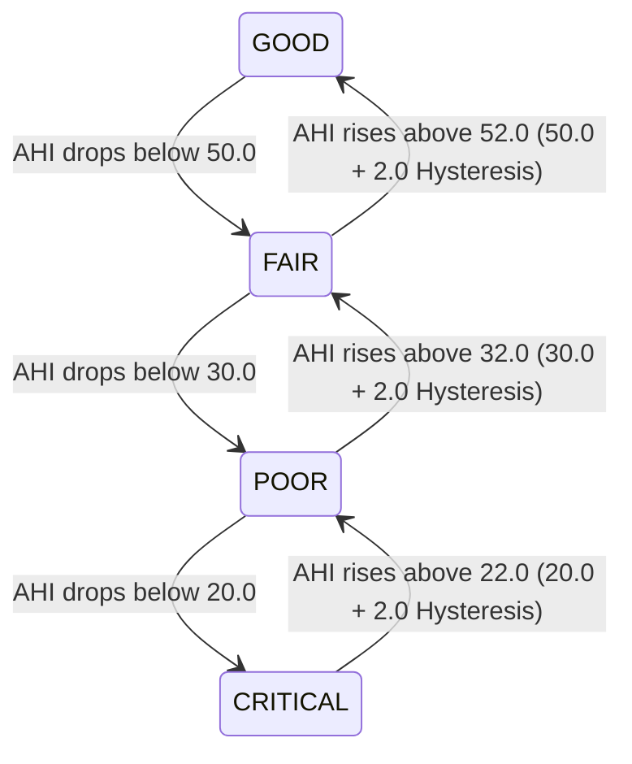

# REAMP - Asset Health State Thresholds & Operational Mapping

**Document Identifier**: `REAMP-ANL-02`  
**Phase**: Phase 6 - Asset Health Model  
**Status**: Approved / Operational Specification  
**Last Updated**: 2026-09-11  

---

## 1. Discrete Health States & Classification Envelopes

The continuous composite Asset Health Index ($AHI \in [0.0, 100.0]$) is mapped into 5 discrete operational health states:

| Health State | Score Range ($AHI$) | Visual Color Token | Operational Meaning |
| :--- | :---: | :---: | :--- |
| **EXCELLENT** | $[85.0, 100.0]$ | `text-success` / `#198754` | Nominal performance, minimal degradation, zero active faults. |
| **GOOD** | $[70.0, 85.0)$ | `text-info` / `#0dcaf0` | Minor efficiency losses or thermal rise, within normal operating envelope. |
| **FAIR** | $[50.0, 70.0)$ | `text-warning` / `#ffc107` | Sub-optimal performance; preventative inspection or cleaning recommended. |
| **POOR** | $[30.0, 50.0)$ | `text-orange` / `#fd7e14` | Significant degradation or recurrent faults; corrective work order drafted. |
| **CRITICAL** | $[0.0, 30.0)$ | `text-danger` / `#dc3545` | Severe physical hazard or impending failure; derating/shutdown required. |

---

## 2. Hysteresis Bands & State Transition Stability

To prevent "chattering" (rapid oscillations between adjacent states when an asset's score hovers near a boundary), REAMP applies a **$2.0\text{-point}$ hysteresis deadband**:

An asset must improve by at least $+2.0\text{ points}$ above the nominal lower boundary before an upward state transition is recognized.

---

## 3. Operational Action Mapping Matrix

Every health state transition triggers deterministic operational actions across the REAMP framework:

| Health State | CMMS Work Order Action | Digital Twin State | SCADA / Control Action | Notification Severity |
| :--- | :--- | :--- | :--- | :--- |
| **EXCELLENT** | No action | `RUNNING` | Full dispatch nominal | `INFO` |
| **GOOD** | Log maintenance metric | `RUNNING` | Full dispatch nominal | `INFO` |
| **FAIR** | Draft inspection task (`P4_LOW`) | `RUNNING_DERATED` | Flag soiling / cooling check | `WARNING` |
| **POOR** | Auto-generate work order (`P2_HIGH`) | `MAINTENANCE_REQUIRED` | Inverter power throttling ($80\%$) | `WARNING` |
| **CRITICAL** | Urgent dispatch work order (`P1_CRITICAL`) | `PROTECTIVE_DERATE` | Automated shutdown / trip request | `CRITICAL` |

---

## 4. Confidence Thresholding & Insufficient Telemetry Gating

If the evaluation confidence score $C_{eval} < 0.50$ (caused by missing critical sensors, communications blackouts, or invalid data quality):
1. The health score is accompanied by the state modifier: `HEALTH_STATE_UNCERTAIN`.
2. UI displays a hatched warning badge: `FAIR (UNCERTAIN - CONFIDENCE 0.35)`.
3. Automated shutdown or commercial penalties are blocked; instead, a **Sensor Calibration & Telemetry Inspection Task** is generated.
