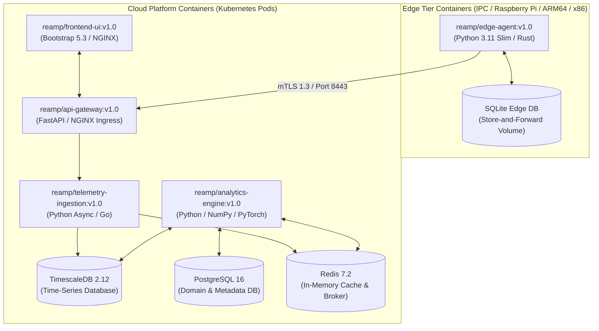

# REAMP — Container Architecture Specification

**Document Identifier**: `REAMP-ARC-01`  
**Phase**: Phase 3 — Reference Architecture  
**Status**: Approved / Quality Gate Passed  
**Last Updated**: 2026-09-11  

---

## 1. Container Topology Overview

REAMP packages all runtime capabilities into OCI-compliant container images (Docker / Containerd). In accordance with `AGENTS.md` Rule 5, containers are organized logically into modular service groups rather than hundreds of micro-containers.

---

## 2. Container Inventory & Specifications

### 2.1 `reamp/edge-agent:v1.0`
- **Role**: Edge protocol polling (Modbus RTU/TCP, OPC UA), local validation, and store-and-forward buffering.
- **Base Image**: `python:3.11-slim` or `rust:1.75-alpine`
- **Resource Constraints**: CPU $\le 0.5$ cores, RAM $\le 256 \text{ MB}$.
- **Persistent Volume**: `/var/lib/reamp/edge_buffer.db` (SQLite volume).
- **Architecture**: `linux/amd64`, `linux/arm64`.

### 2.2 `reamp/api-gateway:v1.0`
- **Role**: Ingress TLS 1.3 termination, JWT authentication, RBAC authorization, rate limiting, REST API routing.
- **Base Image**: `python:3.11-slim` (FastAPI + Uvicorn) or `nginx:1.25-alpine`.
- **Resource Constraints**: CPU $1.0$ cores, RAM $512 \text{ MB}$.
- **Ports Exposed**: `8443` (mTLS Ingestion), `443` (HTTPS User API).

### 2.3 `reamp/telemetry-ingestion:v1.0`
- **Role**: High-throughput stream ingestion, quality metadata tagging (`VALID`, `INVALID`, `STALE`), Redis cache publishing, TimescaleDB batch insertion.
- **Base Image**: `python:3.11-slim`
- **Resource Constraints**: CPU $2.0$ cores, RAM $1.0 \text{ GB}$.
- **Environment Specs**: `BATCH_SIZE=1000`, `FLUSH_INTERVAL_MS=500`.

### 2.4 `reamp/analytics-engine:v1.0`
- **Role**: Computes Asset Health Index ($AHI$), Performance Ratio ($PR_{STC}$), Anomaly Detection (Isolation Forest/Autoencoders), SHAP Feature Attribution, and Predictive CMMS Work Order drafting.
- **Base Image**: `python:3.11-slim` (NumPy, SciPy, PyTorch, SHAP)
- **Resource Constraints**: CPU $4.0$ cores, RAM $4.0 \text{ GB}$.

### 2.5 `reamp/frontend-ui:v1.0`
- **Role**: Serves the Bootstrap 5.3 Light Theme visual client, responsive dashboards, and Human-in-the-Loop decision interfaces.
- **Base Image**: `nginx:1.25-alpine`
- **Resource Constraints**: CPU $0.25$ cores, RAM $128 \text{ MB}$.

---

## 3. Container Network Isolation & Security Policy

1. **Host Network Isolation**: Internal databases (`TimescaleDB`, `PostgreSQL`, `Redis`) MUST NOT expose ports directly to public host interfaces.
2. **Internal Network Subnets**:
   - `reamp-edge-net`: Isolated plant network between field sensors and `reamp/edge-agent`.
   - `reamp-ingest-net`: Network between `api-gateway`, `telemetry-ingestion`, and `Redis`.
   - `reamp-core-net`: Network between `analytics-engine`, `PostgreSQL`, `TimescaleDB`, and `api-gateway`.
