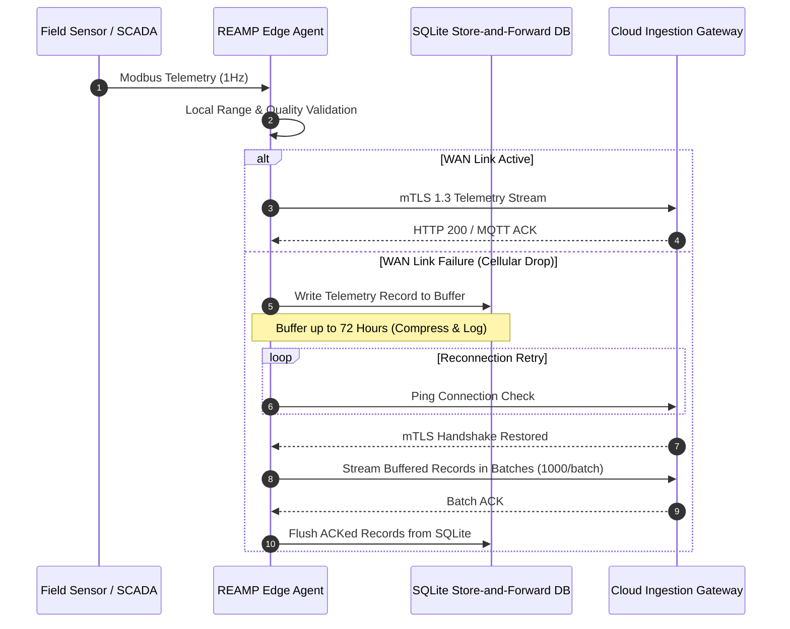

# REAMP - Deployment Architecture Specification

**Document Identifier**: `REAMP-ARC-03`  
**Phase**: Phase 3 - Reference Architecture  
**Status**: Approved / Quality Gate Passed  
**Last Updated**: 2026-09-11  

---

## 1. Deployment Topology Spectrum

REAMP supports three validated deployment models to accommodate diverse physical infrastructure constraints:

```text
┌─────────────────────────────────────────────────────────────────────────┐
│                      REAMP Deployment Spectrum                          │
├─────────────────────────┬───────────────────────┬───────────────────────┤
│ Model A: Hybrid Edge/Cloud│ Model B: Fully Cloud  │ Model C: Air-Gapped   │
│ (Recommended Production)│ (High Bandwidth Sites)│ (High Security On-Prem│
├─────────────────────────┼───────────────────────┼───────────────────────┤
│ • Edge IPC Gateways     │ • Direct SCADA-to-    │ • On-Site Kubernetes  │
│ • Local Store-Forward   │   Cloud Ingestion     │   Cluster (No Cloud)  │
│ • Central Cloud Control │ • Centralized Twin    │ • Local Storage Only  │
└─────────────────────────┴───────────────────────┴───────────────────────┘
```

---

## 2. Model A: Hybrid Edge/Cloud Topology (Recommended)

### 2.1 Edge Substation Deployment
- **Hardware Spec**: Siemens Microbox IPC or Advantech Industrial PC (4-core x86 or ARM64, 4GB RAM, 128GB SSD).
- **Runtime Stack**: K3s Lightweight Kubernetes or Docker Compose.
- **Components Installed**: `reamp/edge-agent:v1.0`, `SQLite Edge DB`.
- **Local Network Connection**: Modbus TCP over local RS485/Ethernet to plant inverters, meters, and weather stations.

### 2.2 Cloud Center Deployment
- **Hardware Spec**: Cloud Kubernetes Cluster (EKS / GKE / AKS or On-Prem OpenShift).
- **Components Installed**: All core cloud microservices (`api-gateway`, `telemetry-ingestion`, `analytics-engine`, `frontend-ui`, `TimescaleDB`, `PostgreSQL`, `Redis`).

---

## 3. Store-and-Forward Network Recovery Protocol



---

## 4. Bandwidth Optimization & Data Throttling Rules

To prevent cellular data overages on remote site links:

1. **High-Frequency Ingestion Throttling**: Normal operational telemetry is aggregated at the Edge into 1-minute or 5-minute statistical mean/std-dev summaries prior to Cloud transmission.
2. **Burst-on-Anomaly**: When a local Edge range check or rate-of-change limit is breached, the Edge agent instantly overrides throttling, streaming raw 1Hz telemetry to the Cloud until nominal operation resumes.
3. **Data Compression**: All mTLS payload streams use Gzip / Brotli payload compression, reducing WAN bandwidth consumption by up to 70%.
