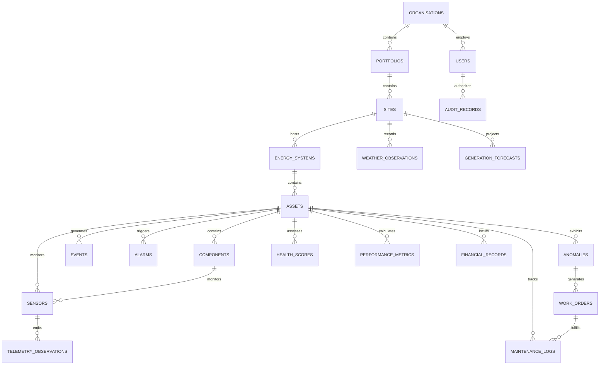

# REAMP — Canonical Data Model Specification

**Document Identifier**: `REAMP-DAT-01`  
**Phase**: Phase 4 — Data Architecture and Telemetry Model  
**Status**: Approved / Canonical Design  
**Last Updated**: 2026-09-11  

---

## 1. Overview & Entity Relationship Topology

The REAMP Canonical Data Model defines the schema architecture across **20 unified data domains**. The model enforces Clean Architecture, strict multi-tenancy (`tenant_id`), referential integrity, and technology extensibility for Solar PV, Wind, BESS, and Hybrid power plants.

---

## 2. The 20 Canonical Data Domains

### 2.1 Organisations (`organisations`)
- **Purpose**: Top-level multi-tenant enterprise boundary (`Level 1`).
- **Attributes**:
  - `id` (UUID, PK): Unique organisation identifier.
  - `tenant_id` (UUID, Unique, Indexed): Multi-tenant partition key.
  - `name` (VARCHAR(255), NOT NULL): Commercial organisation name.
  - `code` (VARCHAR(64), Unique, NOT NULL): Human-readable code (e.g., `ORG-PREI`).
  - `billing_tier` (VARCHAR(32), Default `'ENTERPRISE'`): Subscription tier.
  - `created_at`, `updated_at` (TIMESTAMPTZ, Default `NOW()`).

### 2.2 Portfolios (`portfolios`)
- **Purpose**: Regional or investment grouping of assets (`Level 2`).
- **Attributes**:
  - `id` (UUID, PK)
  - `tenant_id` (UUID, FK -> `organisations.tenant_id`, Indexed)
  - `organisation_id` (UUID, FK -> `organisations.id`, NOT NULL)
  - `name` (VARCHAR(255), NOT NULL)
  - `code` (VARCHAR(64), NOT NULL)
  - `region` (VARCHAR(128), NOT NULL): e.g., `North America West`.
  - `target_capacity_kw` (NUMERIC(12, 2), NOT NULL)
  - `created_at`, `updated_at` (TIMESTAMPTZ)

### 2.3 Sites (`sites`)
- **Purpose**: Physical geographic land parcels hosting energy infrastructure (`Level 4`).
- **Attributes**:
  - `id` (UUID, PK)
  - `tenant_id` (UUID, FK -> `organisations.tenant_id`, Indexed)
  - `portfolio_id` (UUID, FK -> `portfolios.id`, NOT NULL)
  - `name` (VARCHAR(255), NOT NULL)
  - `code` (VARCHAR(64), NOT NULL)
  - `latitude` (NUMERIC(9, 6), NOT NULL): Range $-90.0$ to $+90.0$.
  - `longitude` (NUMERIC(9, 6), NOT NULL): Range $-180.0$ to $+180.0$.
  - `altitude_m` (NUMERIC(6, 1))
  - `timezone` (VARCHAR(64), NOT NULL): e.g., `America/Los_Angeles`.
  - `grid_interconnection_voltage_kv` (NUMERIC(6, 2))
  - `created_at`, `updated_at` (TIMESTAMPTZ)

### 2.4 Energy Systems (`energy_systems`)
- **Purpose**: Discrete power generation blocks (`Level 5`).
- **Attributes**:
  - `id` (UUID, PK)
  - `tenant_id` (UUID, FK -> `organisations.tenant_id`, Indexed)
  - `site_id` (UUID, FK -> `sites.id`, NOT NULL)
  - `name` (VARCHAR(255), NOT NULL)
  - `code` (VARCHAR(64), NOT NULL)
  - `technology_type` (VARCHAR(32), NOT NULL): `SOLAR_PV`, `WIND`, `BESS`, `HYBRID`.
  - `nameplate_capacity_kw` (NUMERIC(12, 2), NOT NULL)
  - `lifecycle_state` (VARCHAR(32), NOT NULL): `PLANNED`, `COMMISSIONED`, `OPERATIONAL`, `DECOMMISSIONED`.
  - `technology_metadata` (JSONB, Default `'{}'`): Validated technology attributes.
  - `created_at`, `updated_at` (TIMESTAMPTZ)

### 2.5 Assets (`assets`)
- **Purpose**: Primary physical electro-mechanical machines (`Level 6`).
- **Attributes**:
  - `id` (UUID, PK)
  - `tenant_id` (UUID, FK -> `organisations.tenant_id`, Indexed)
  - `energy_system_id` (UUID, FK -> `energy_systems.id`, NOT NULL)
  - `parent_asset_id` (UUID, FK -> `assets.id`, Nullable): Hierarchical asset nesting.
  - `name` (VARCHAR(255), NOT NULL)
  - `code` (VARCHAR(64), NOT NULL)
  - `asset_type` (VARCHAR(64), NOT NULL): `PV_INVERTER`, `WIND_TURBINE`, `BESS_CONTAINER`, `TRANSFORMER`.
  - `lifecycle_state` (VARCHAR(32), NOT NULL)
  - `manufacturer` (VARCHAR(128))
  - `model_number` (VARCHAR(128))
  - `serial_number` (VARCHAR(128))
  - `commissioning_date` (DATE)
  - `warranty_expiration` (DATE)
  - `technology_metadata` (JSONB, Default `'{}'`)
  - `created_at`, `updated_at` (TIMESTAMPTZ)

### 2.6 Components (`components`)
- **Purpose**: Replaceable field modules within an asset (`Level 7`).
- **Attributes**:
  - `id` (UUID, PK)
  - `tenant_id` (UUID, FK -> `organisations.tenant_id`, Indexed)
  - `asset_id` (UUID, FK -> `assets.id`, NOT NULL)
  - `parent_component_id` (UUID, FK -> `components.id`, Nullable): Sub-component trees.
  - `name` (VARCHAR(255), NOT NULL)
  - `code` (VARCHAR(64), NOT NULL)
  - `component_type` (VARCHAR(64), NOT NULL): `IGBT_MODULE`, `BEARING`, `BATTERY_MODULE`, `PITCH_ACTUATOR`.
  - `lifecycle_state` (VARCHAR(32), NOT NULL)
  - `part_number` (VARCHAR(128))
  - `serial_number` (VARCHAR(128))
  - `created_at`, `updated_at` (TIMESTAMPTZ)

### 2.7 Sensors (`sensors`)
- **Purpose**: Physical or virtual telemetry transducers (`Level 8`).
- **Attributes**:
  - `id` (UUID, PK)
  - `tenant_id` (UUID, FK -> `organisations.tenant_id`, Indexed)
  - `asset_id` (UUID, FK -> `assets.id`, Nullable)
  - `component_id` (UUID, FK -> `components.id`, Nullable)
  - `name` (VARCHAR(255), NOT NULL)
  - `code` (VARCHAR(64), NOT NULL)
  - `sensor_type` (VARCHAR(64), NOT NULL): `ELECTRICAL_POWER_ACTIVE`, `TEMPERATURE_SURFACE`, `IRRADIANCE_POA`, `WIND_SPEED`, `STATE_OF_CHARGE`.
  - `unit_of_measure` (VARCHAR(32), NOT NULL): `kW`, `degC`, `W/m2`, `m/s`, `%`.
  - `sampling_interval_sec` (INTEGER, NOT NULL, Default 1)
  - `modbus_address` (VARCHAR(32), Nullable)
  - `opc_node_id` (VARCHAR(128), Nullable)
  - `mqtt_topic` (VARCHAR(255), Nullable)
  - `min_physical_range` (NUMERIC(12, 4))
  - `max_physical_range` (NUMERIC(12, 4))
  - `created_at`, `updated_at` (TIMESTAMPTZ)
  - *Invariant*: Exactly one of `asset_id` OR `component_id` MUST be non-null.

### 2.8 Telemetry Observations (`telemetry_observations`)
- **Purpose**: Canonical immutable time-series observations (TimescaleDB hypertable).
- **Attributes**:
  - `timestamp` (TIMESTAMPTZ, NOT NULL, Part of Composite PK)
  - `tenant_id` (UUID, NOT NULL, Part of Composite PK)
  - `asset_id` (UUID, NOT NULL, Part of Composite PK)
  - `sensor_id` (UUID, NOT NULL)
  - `metric` (VARCHAR(64), NOT NULL)
  - `value` (DOUBLE PRECISION, NOT NULL)
  - `unit` (VARCHAR(32), NOT NULL)
  - `source` (VARCHAR(32), NOT NULL): `SCADA`, `INVERTER_MODBUS`, `BMS_CAN`, `MET_MAST`, `EDGE_ESTIMATED`.
  - `quality` (VARCHAR(16), NOT NULL): `VALID`, `INVALID`, `MISSING`, `STALE`, `UNCERTAIN`.
  - `confidence` (REAL, NOT NULL): Range $0.00$ to $1.00$.
  - `communication_status` (VARCHAR(16), NOT NULL): `ONLINE`, `DEGRADED`, `OFFLINE`, `BUFFERED`.

### 2.9 Events (`events`)
- **Purpose**: Discrete state transitions, operational commands, and system events.
- **Attributes**:
  - `id` (UUID, PK)
  - `tenant_id` (UUID, NOT NULL, Indexed)
  - `asset_id` (UUID, NOT NULL)
  - `timestamp` (TIMESTAMPTZ, NOT NULL)
  - `event_type` (VARCHAR(64), NOT NULL): `STATE_CHANGE`, `CURTAILMENT_COMMAND`, `GRID_TRIP`, `MAINTENANCE_WINDOW`.
  - `severity` (VARCHAR(16), NOT NULL): `INFO`, `WARNING`, `CRITICAL`.
  - `payload` (JSONB, Default `'{}'`)
  - `created_at` (TIMESTAMPTZ)

### 2.10 Alarms (`alarms`)
- **Purpose**: Real-time threshold violations and safety trips requiring operator acknowledgment.
- **Attributes**:
  - `id` (UUID, PK)
  - `tenant_id` (UUID, NOT NULL, Indexed)
  - `asset_id` (UUID, NOT NULL)
  - `sensor_id` (UUID, Nullable)
  - `alarm_code` (VARCHAR(64), NOT NULL): e.g., `ALM-INV-OVERTEMP-01`.
  - `status` (VARCHAR(16), NOT NULL): `ACTIVE`, `ACKNOWLEDGED`, `CLEARED`, `SUPPRESSED`.
  - `severity` (VARCHAR(16), NOT NULL): `LOW`, `MEDIUM`, `HIGH`, `EMERGENCY`.
  - `trigger_timestamp` (TIMESTAMPTZ, NOT NULL)
  - `cleared_timestamp` (TIMESTAMPTZ, Nullable)
  - `acknowledged_by` (UUID, Nullable)
  - `acknowledged_at` (TIMESTAMPTZ, Nullable)

### 2.11 Anomalies (`anomalies`)
- **Purpose**: Statistical, ML, or physics-guided multi-variate anomaly detections.
- **Attributes**:
  - `id` (UUID, PK)
  - `tenant_id` (UUID, NOT NULL, Indexed)
  - `asset_id` (UUID, NOT NULL)
  - `detection_timestamp` (TIMESTAMPTZ, NOT NULL)
  - `detector_model` (VARCHAR(64), NOT NULL): `ISOLATION_FOREST`, `AUTOENCODER_V1`, `PHYSICS_RESIDUAL`.
  - `anomaly_score` (REAL, NOT NULL): Range $0.00$ to $1.00$.
  - `root_cause_prediction` (JSONB, NOT NULL): Top probable causes with likelihoods.
  - `shap_feature_importance` (JSONB, NOT NULL): Feature contribution vector.
  - `status` (VARCHAR(32), NOT NULL): `NEW`, `TRIAGED`, `CONFIRMED_FAULT`, `FALSE_POSITIVE`.

### 2.12 Maintenance Logs (`maintenance_logs`)
- **Purpose**: Chronological physical field service and repair logs.
- **Attributes**:
  - `id` (UUID, PK)
  - `tenant_id` (UUID, NOT NULL, Indexed)
  - `asset_id` (UUID, NOT NULL)
  - `component_id` (UUID, Nullable)
  - `work_order_id` (UUID, Nullable)
  - `technician_name` (VARCHAR(128), NOT NULL)
  - `performed_at` (TIMESTAMPTZ, NOT NULL)
  - `maintenance_type` (VARCHAR(32), NOT NULL): `CORRECTIVE`, `PREVENTIVE`, `INSPECTION`.
  - `actions_taken` (TEXT, NOT NULL)
  - `replaced_parts` (JSONB, Default `'[]'`)

### 2.13 Work Orders (`work_orders`)
- **Purpose**: Prescriptive CMMS work orders awaiting or executing HITL workflows.
- **Attributes**:
  - `id` (UUID, PK)
  - `tenant_id` (UUID, NOT NULL, Indexed)
  - `asset_id` (UUID, NOT NULL)
  - `anomaly_id` (UUID, Nullable)
  - `order_number` (VARCHAR(64), Unique, NOT NULL): e.g., `WO-2026-00481`.
  - `priority` (VARCHAR(16), NOT NULL): `P1_CRITICAL`, `P2_HIGH`, `P3_MEDIUM`, `P4_LOW`.
  - `status` (VARCHAR(32), NOT NULL): `DRAFT`, `PENDING_HITL_APPROVAL`, `APPROVED`, `DISPATCHED`, `COMPLETED`, `REJECTED`.
  - `recommended_action` (TEXT, NOT NULL)
  - `estimated_labor_hours` (NUMERIC(6, 2))
  - `required_skill_level` (VARCHAR(64))
  - `created_at`, `updated_at` (TIMESTAMPTZ)

### 2.14 Weather Observations (`weather_observations`)
- **Purpose**: On-site meteorological sensor readings.
- **Attributes**:
  - `timestamp` (TIMESTAMPTZ, NOT NULL)
  - `tenant_id` (UUID, NOT NULL)
  - `site_id` (UUID, NOT NULL)
  - `ghi_w_per_m2` (REAL)
  - `poa_w_per_m2` (REAL)
  - `ambient_temp_c` (REAL)
  - `wind_speed_m_per_s` (REAL)
  - `wind_direction_deg` (REAL)
  - `relative_humidity_pct` (REAL)
  - `soiling_ratio` (REAL): Range $0.00$ to $1.00$.

### 2.15 Generation Forecasts (`generation_forecasts`)
- **Purpose**: Short-term (day-ahead / intra-day) energy generation forecasts.
- **Attributes**:
  - `id` (UUID, PK)
  - `tenant_id` (UUID, NOT NULL, Indexed)
  - `energy_system_id` (UUID, NOT NULL)
  - `forecast_generated_at` (TIMESTAMPTZ, NOT NULL)
  - `target_timestamp` (TIMESTAMPTZ, NOT NULL)
  - `forecast_horizon_hours` (INTEGER, NOT NULL): e.g., 24, 48.
  - `expected_power_kw` (NUMERIC(12, 2), NOT NULL)
  - `confidence_lower_p10_kw` (NUMERIC(12, 2))
  - `confidence_upper_p90_kw` (NUMERIC(12, 2))
  - `forecast_model` (VARCHAR(64), NOT NULL)

### 2.16 Performance Metrics (`performance_metrics`)
- **Purpose**: Calculated asset efficiency and performance indices.
- **Attributes**:
  - `id` (UUID, PK)
  - `tenant_id` (UUID, NOT NULL, Indexed)
  - `asset_id` (UUID, NOT NULL)
  - `calculation_timestamp` (TIMESTAMPTZ, NOT NULL)
  - `aggregation_period` (VARCHAR(16), NOT NULL): `15MIN`, `1HOUR`, `1DAY`, `1MONTH`.
  - `performance_ratio_stc` (REAL): IEC 61724-1 temperature-compensated $PR_{STC}$.
  - `power_coefficient_cp` (REAL): Wind turbine $C_p$ relative to Betz limit.
  - `round_trip_efficiency_rte` (REAL): BESS $RTE$ percentage.
  - `availability_factor_pct` (REAL)

### 2.17 Health Scores (`health_scores`)
- **Purpose**: Asset Health Index ($AHI$) and component condition records.
- **Attributes**:
  - `id` (UUID, PK)
  - `tenant_id` (UUID, NOT NULL, Indexed)
  - `asset_id` (UUID, NOT NULL)
  - `calculation_timestamp` (TIMESTAMPTZ, NOT NULL)
  - `asset_health_index` (REAL, NOT NULL): Normalized $AHI \in [0.0, 100.0]$.
  - `sub_index_thermal` (REAL)
  - `sub_index_electrical` (REAL)
  - `sub_index_mechanical` (REAL)
  - `sub_index_maintenance` (REAL)
  - `estimated_remaining_useful_life_days` (INTEGER)

### 2.18 Risk & Financial Records (`financial_records`)
- **Purpose**: Financial impact attribution and yield loss quantification.
- **Attributes**:
  - `id` (UUID, PK)
  - `tenant_id` (UUID, NOT NULL, Indexed)
  - `asset_id` (UUID, NOT NULL)
  - `period_start` (TIMESTAMPTZ, NOT NULL)
  - `period_end` (TIMESTAMPTZ, NOT NULL)
  - `lost_energy_kwh` (NUMERIC(14, 3), NOT NULL)
  - `applied_ppa_rate_per_mwh` (NUMERIC(8, 2), NOT NULL)
  - `financial_loss_amount` (NUMERIC(12, 2), NOT NULL)
  - `currency` (VARCHAR(3), NOT NULL): `USD`, `EUR`, `GBP`.
  - `loss_attribution_category` (VARCHAR(64), NOT NULL): `INVERTER_DERATING`, `SOILING`, `CURTAILMENT`, `TRIP`.

### 2.19 Users (`users`)
- **Purpose**: Authorized operator and engineer identity profiles.
- **Attributes**:
  - `id` (UUID, PK)
  - `tenant_id` (UUID, NOT NULL, Indexed)
  - `email` (VARCHAR(255), Unique, NOT NULL)
  - `full_name` (VARCHAR(255), NOT NULL)
  - `role` (VARCHAR(32), NOT NULL): `ADMIN`, `PORTFOLIO_MGR`, `OPERATOR`, `ENGINEER`, `AUDITOR`.
  - `is_active` (BOOLEAN, Default `TRUE`)
  - `created_at`, `updated_at` (TIMESTAMPTZ)

### 2.20 Audit Records (`audit_records`)
- **Purpose**: Immutable, append-only security and operational action audit trail.
- **Attributes**:
  - `id` (UUID, PK)
  - `tenant_id` (UUID, NOT NULL, Indexed)
  - `user_id` (UUID, Nullable)
  - `action` (VARCHAR(64), NOT NULL): `APPROVE_WORK_ORDER`, `OVERRIDE_CURTAILMENT`, `UPDATE_METADATA`.
  - `target_entity_type` (VARCHAR(64), NOT NULL)
  - `target_entity_id` (UUID, NOT NULL)
  - `before_state` (JSONB)
  - `after_state` (JSONB)
  - `ip_address` (INET)
  - `user_agent` (TEXT)
  - `timestamp` (TIMESTAMPTZ, NOT NULL, Default `NOW()`)
