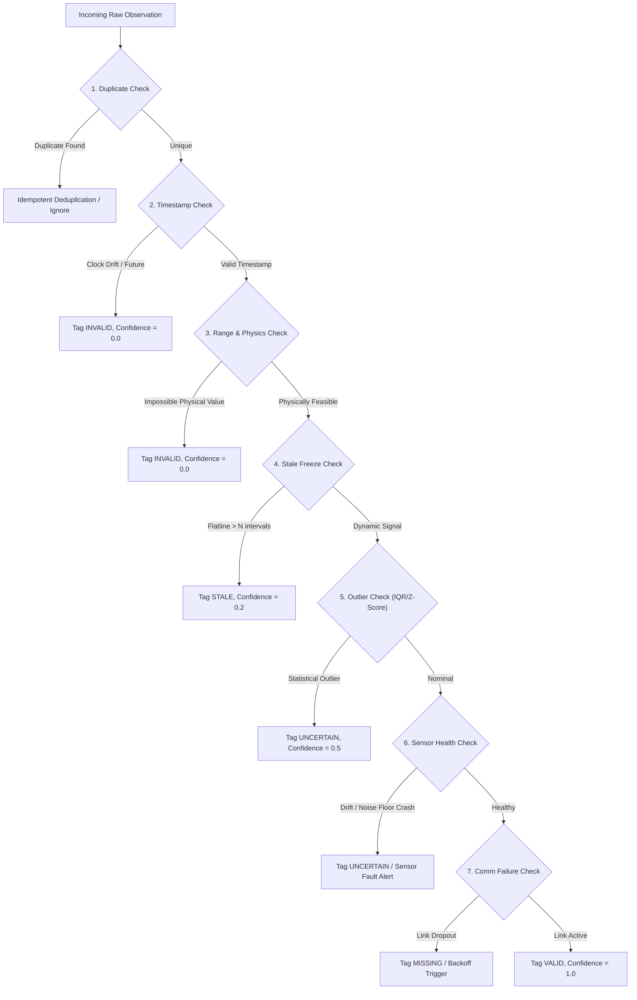

# REAMP - Data Quality & Provenance Model Specification

**Document Identifier**: `REAMP-DAT-03`  
**Phase**: Phase 4 - Data Architecture and Telemetry Model  
**Status**: Approved / Canonical Design  
**Last Updated**: 2026-09-11  

---

## 1. Overview & Operating Philosophy

In strict accordance with `AGENTS.md` Rule 7 ("Never allow invalid, missing, stale or low-confidence telemetry to be silently treated as trustworthy data"), the REAMP Data Quality Engine validates every incoming observation before analytical processing.

Data quality validation executes at two stages:
1. **Edge-Level Screening**: Lightweight physical range checking and communication timeout detection on the local Edge IPC.
2. **Cloud Pipeline Validation**: Deep multi-variate outlier screening, freeze detection, timestamp verification, and redundant sensor cross-calibration in the `reamp.data_quality` service.

---

## 2. The 8 Data Quality Failure Modes & Mitigation Mechanisms



---

### 2.1 Failure Mode 1: Missing Data

- **Definition**: Telemetry expected for a registered sensor at an interval $T_{sampling}$ is not received within timeout window $T_{timeout} = 3 \times T_{sampling}$.
- **Detection Algorithm**:
  ```python
  elapsed_sec = current_time - last_received_timestamp[sensor_id]
  if elapsed_sec > (3 * sampling_interval_sec):
      record_state = "MISSING"
  ```
- **Quality & Confidence Impact**:
  - `quality = MISSING`
  - `confidence = 0.0`
  - Synthetic `NULL` record appended to time-series stream with provenance flag.
- **Mitigation Action**:
  - Upstream analytical models must NOT treat missing readings as zero (e.g., zero irradiance must be distinguished from missing sensor reading).
  - Short gaps ($\le 3$ intervals) are linearly interpolated only for aggregate display views, clearly flagged as `imputed = true`.
  - Analytical engines (AHI, PR) ignore missing intervals and decrement sample availability denominators.

---

### 2.2 Failure Mode 2: Stale Data (Freeze / Flatlining)

- **Definition**: A sensor repeatedly reports the exact identical floating-point value across $N$ consecutive sampling intervals during periods when physical variance is expected.
- **Detection Algorithm**:
  For an observation sequence $X = [x_1, x_2, \dots, x_N]$ over window $W$:
  $$\sigma^2(X) = \frac{1}{N}\sum_{i=1}^N (x_i - \bar{x})^2$$
  If $\sigma^2(X) < \epsilon$ and physical operating conditions mandate variance (e.g., daytime solar irradiance, operating wind turbine):
  $$\text{Quality} = \text{STALE}$$
- **Quality & Confidence Impact**:
  - `quality = STALE`
  - `confidence = 0.20`
- **Mitigation Action**:
  - Telemetry is excluded from real-time performance ratio ($PR_{STC}$) and health calculations.
  - Alert `ALM-SEN-FREEZE-01` dispatched to operations queue if frozen state persists $> 30$ minutes.

---

### 2.3 Failure Mode 3: Duplicate Data

- **Definition**: Observations received with identical `(tenant_id, asset_id, metric, timestamp)` tuple, typically resulting from network retries or edge store-and-forward retransmissions.
- **Detection Algorithm**:
  - Database primary key constraint / Redis Bloom filter check over composite key:
    $$\text{Key} = \text{SHA256}(tenant\_id + asset\_id + metric + timestamp)$$
- **Quality & Confidence Impact**:
  - Retains original quality classification.
- **Mitigation Action**:
  - Ingestion pipeline executes idempotent upsert:
    `ON CONFLICT (tenant_id, asset_id, metric, timestamp) DO UPDATE SET quality = EXCLUDED.quality, confidence = EXCLUDED.confidence`.
  - Redundant network traffic dropped without incrementing ingestion error counters.

---

### 2.4 Failure Mode 4: Impossible Values (Physical Bounds Violation)

- **Definition**: Measured value violates fundamental physical or thermodynamic laws, or exceeds nameplate hardware bounds.
- **Detection Algorithm**:
  Every sensor defines physical bounds $[V_{min}, V_{max}]$:
  $$\text{If } v < V_{min} \lor v > V_{max} \implies \text{INVALID}$$
  *Standard Physical Thresholds*:
  - Global Horizontal Irradiance ($GHI$): $[0.0, 1500.0]\text{ W/m}^2$
  - Surface Temperature: $[-40.0, +125.0]\text{ }^\circ\text{C}$
  - Battery State of Charge ($SoC$): $[0.0, 100.0]\%$
  - Inverter Active Power: $[0.0, 1.25 \times P_{nameplate}]\text{ kW}$
  - Wind Speed: $[0.0, 60.0]\text{ m/s}$
- **Quality & Confidence Impact**:
  - `quality = INVALID`
  - `confidence = 0.00`
- **Mitigation Action**:
  - Dropped from all analytical feature sets.
  - Flagged for immediate transducer hardware inspection.

---

### 2.5 Failure Mode 5: Outliers (Statistical Deviations)

- **Definition**: Value is physically possible but statistically anomalous relative to rolling local temporal context or peer sensors.
- **Detection Algorithm**:
  Rolling Modified Z-Score over sliding window of 60 observations:
  $$M_i = \frac{0.6745 \cdot (x_i - \tilde{x})}{\text{MAD}}$$
  Where $\tilde{x}$ is median and $\text{MAD}$ is Median Absolute Deviation.
  $$\text{If } |M_i| > 3.5 \implies \text{UNCERTAIN}$$
- **Quality & Confidence Impact**:
  - `quality = UNCERTAIN`
  - `confidence = 0.50`
- **Mitigation Action**:
  - Passed to Anomaly Detection Engine (`reamp.anomaly`) for secondary multi-variate validation.
  - Retained in time-series store with confidence penalty.

---

### 2.6 Failure Mode 6: Timestamp Problems (Clock Drift & Future Dates)

- **Definition**: Observation timestamp is either:
  1. In the future relative to cloud server NTP time: $T_{obs} > T_{server} + \Delta_{tolerance}$ (where $\Delta_{tolerance} = 5.0\text{ s}$).
  2. Severely back-dated beyond historical ingestion window ($> 30\text{ days}$).
  3. Non-monotonic backwards jump in sensor sampling sequence.
- **Detection Algorithm**:
  $$\text{Clock Skew } \delta = |T_{obs} - T_{server}|$$
  $$\text{If } T_{obs} > T_{server} + 5.0\text{ s} \implies \text{INVALID}$$
- **Quality & Confidence Impact**:
  - `quality = INVALID`
  - `confidence = 0.00`
- **Mitigation Action**:
  - Future-dated timestamps are rejected with HTTP 422 Unprocessable Entity.
  - Edge IPCs execute local chrony/NTP sync check and resynchronize hardware RTC.

---

### 2.7 Failure Mode 7: Sensor Malfunction & Calibration Drift

- **Definition**: Transducer drift, open circuit (reporting max rail voltage), short circuit (reporting zero), or cross-sensor discrepancy between redundant sensor pairs.
- **Detection Algorithm**:
  Dual-pyranometer / dual-inverter current cross-comparison:
  $$\text{Relative Drift } D = \frac{|v_{sensor\_A} - v_{sensor\_B}|}{\max(v_{sensor\_A}, v_{sensor\_B})}$$
  $$\text{If } D > 0.03 \text{ for } > 1\text{ hour } \implies \text{UNCERTAIN}$$
- **Quality & Confidence Impact**:
  - `quality = UNCERTAIN`
  - `confidence = 0.60`
- **Mitigation Action**:
  - `FR-DQ-003`: Triggers Automated Calibration Drift Alert (`ALM-SEN-DRIFT-01`).
  - Flagged in digital twin state for technician recalibration.

---

### 2.8 Failure Mode 8: Communication Failure

- **Definition**: Intermittent WAN disconnects, cellular packet drop, or edge gateway hardware reboot.
- **Detection Algorithm**:
  Edge heartbeat timeout tracked in Redis:
  $$\text{If } \text{Heartbeat age} > 60\text{ s} \implies \text{communication\_status} = \text{OFFLINE}$$
- **Quality & Confidence Impact**:
  - Central platform flags active asset communication state as `OFFLINE`.
  - When backfill begins from edge buffer, incoming records are marked with `communication_status = BUFFERED` and `confidence = 0.95`.
- **Mitigation Action**:
  - Edge SQLite buffer stores records up to 72 hours (`FR-ING-002`).
  - Seamless backfill upon reconnection with guaranteed temporal order.

---

## 3. Data Quality Engine State Transition Table

| Current Quality | Test Evaluated | Outcome | New Quality | Confidence | Action |
| :--- | :--- | :--- | :--- | :--- | :--- |
| `NEW` | Duplicate Key | Duplicate | Drop/Skip | N/A | Log debug metric |
| `NEW` | Future Timestamp | Skew $> 5\text{s}$ | `INVALID` | `0.0` | Reject packet |
| `NEW` | Physical Bounds | Out of bounds | `INVALID` | `0.0` | Commit with tag |
| `NEW` | Freeze Check | Variance $< \epsilon$ | `STALE` | `0.2` | Dispatch warning |
| `NEW` | Outlier Check | Modified $Z > 3.5$ | `UNCERTAIN` | `0.5` | Route to ML engine |
| `NEW` | Cross-sensor Drift | Drift $> 3\%$ | `UNCERTAIN` | `0.6` | Flag recalibration |
| `NEW` | All checks pass | Clean | `VALID` | `1.0` | Publish to stream |
