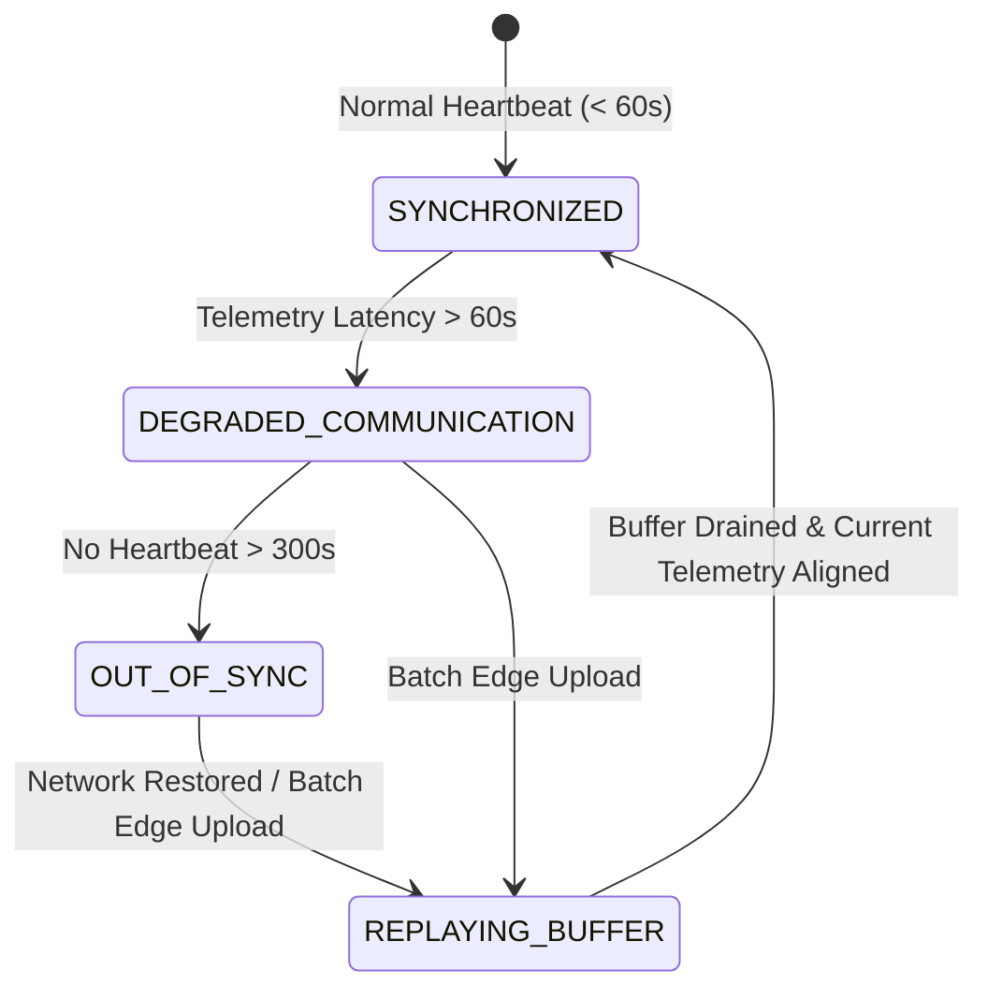

# REAMP Digital Twin State Synchronization Protocol

## 1. Overview & Synchronization Challenges

A digital twin is only as trustworthy as the data pipeline synchronizing it with physical reality. In utility-scale renewable generation, assets operate across geographically dispersed, bandwidth-constrained, and intermittently connected edge sites.

The **REAMP Digital Twin Synchronization Engine** addresses four primary industrial synchronization challenges:
1. **Communication Intermittency**: Cellular/satellite telemetry blackouts lasting minutes to days;
2. **Clock Drift & Skew**: Discrepancies between edge inverter local RTC clocks and NTP cloud servers;
3. **Out-of-Order Packet Delivery**: Asynchronous edge buffering and network retries;
4. **Supervisory State Conflicts**: Discrepancies between supervisory cloud control commands and local autonomous edge protection logic.

---

## 2. Synchronization State Machine

The digital twin continuously evaluates synchronization health, transitioning across four discrete states:

| State | Condition & Latency | Digital Twin Operational Behavior |
| :--- | :--- | :--- |
| **`SYNCHRONIZED`** | Current telemetry timestamp is within $\le 60\text{ seconds}$ of wall-clock time. | Active real-time physics residual calculation; full confidence ($1.0$). |
| **`DEGRADED_COMMUNICATION`**| Telemetry age between $60\text{ and } 300\text{ seconds}$. | Twin flags warnings; freezes real-time residual alarms; sets confidence to $0.75$. |
| **`OUT_OF_SYNC`** | Telemetry age $> 300\text{ seconds}$ (5 minutes). | Twin declares asset telemetry stale; refuses real-time anomaly detection; marks health confidence as `STALE`. |
| **`REPLAYING_BUFFER`** | Edge connection restored; ingesting batched store-and-forward packets. | Reconstructs historical state trajectory sequentially; suppresses spurious transient alarms. |

---

## 3. Store-and-Forward Re-synchronization Protocol

When an edge gateway recovers from an outage, it replays records from its persistent SQLite buffer (established in Phase 5).

### Re-synchronization Sequence:
1. **Batch Ingestion**: Edge gateway transmits historical observation records ordered by monotonic sequence counter $N$ and UTC timestamp.
2. **Resequencing Pass**: The digital twin sync engine buffers incoming frames, reorders any out-of-order packets using sequence numbers, and filters duplicates.
3. **State History Reconstruction**: Historical frames are fed through the twin's physics engine to calculate historical residuals ($\Delta P(t), \Delta T(t)$), maintaining an unbroken operational audit record.
4. **Current State Alignment**: Once the buffer head matches current wall-clock time ($\Delta t < 60\text{s}$), the twin transitions from `REPLAYING_BUFFER` to `SYNCHRONIZED`.

---

## 4. Clock Skew & Data Quality Enforcement

In accordance with `AGENTS.md` Rule 7 (Data Integrity):
> *"Never allow invalid, missing, stale or low-confidence telemetry to be silently treated as trustworthy data."*

The sync engine enforces:
- **Future-Dated Packet Rejection**: Telemetry with timestamps $> 10\text{ seconds}$ in the future (relative to cloud UTC) is rejected and flagged as `CLOCK_SKEW_ERROR`.
- **Monotonic Time Validation**: Telemetry records must advance monotonically; backwards jumps within a single continuous stream trigger sequence validation checks.
- **Quality Bitmask Propagation**: Raw telemetry quality flags (`VALID`, `ESTIMATED`, `SUSPECT`, `FAILED`) are carried through to the digital twin state, ensuring downstream AI/ML models never treat interpolated data as empirical truth.
