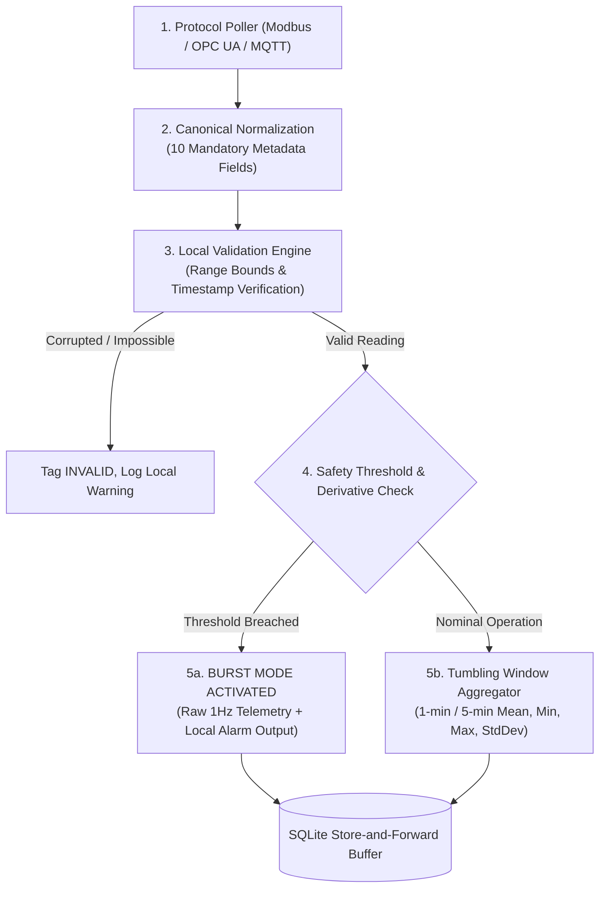

# REAMP — Edge Local Data Pipeline Specification

**Document Identifier**: `REAMP-EDG-02`  
**Phase**: Phase 5 — Edge, Fog and IoT Integration  
**Status**: Approved / Implementation Specification  
**Last Updated**: 2026-09-11  

---

## 1. Overview & Processing Architecture

The **REAMP Edge Data Pipeline** processes high-frequency sensor readings locally on the Edge Gateway prior to buffer persistence or cloud transmission.

The pipeline achieves three primary operational objectives:
1. **Immediate Data Quality Screening**: Flags impossible or corrupted measurements at the plant boundary before they enter the data stream.
2. **Bandwidth Optimization**: Aggregates high-frequency (1Hz) channels into statistical summary envelopes during nominal operation.
3. **Burst-on-Anomaly & Local Safety Protection**: Detects local threshold breaches and immediately dispatches local emergency trip signals while switching data streaming to high-resolution raw telemetry.

---

## 2. Edge Pipeline Stage Breakdown



---

## 3. Local Aggregation & Downsampling Algorithm

### 3.1 Tumbling Window Specification
For nominal telemetry channels, the edge maintains a fixed 60-second tumbling window:
$$W_k = [t_k, t_k + 60\text{ s})$$

For each metric $m$ received during window $W_k$ with observations $V = [v_1, v_2, \dots, v_n]$:
1. **Sample Count**: $n$
2. **Mean**: $\bar{v} = \frac{1}{n} \sum_{i=1}^n v_i$
3. **Minimum**: $v_{min} = \min(V)$
4. **Maximum**: $v_{max} = \max(V)$
5. **Standard Deviation**:
   $$s = \sqrt{\frac{1}{n-1} \sum_{i=1}^n (v_i - \bar{v})^2}$$

### 3.2 Transmitted Aggregation Payload
```json
{
  "tenant_id": "a0eebc99-9c0b-4ef8-bb6d-6bb9bd380a11",
  "asset_id": "b1eebc99-9c0b-4ef8-bb6d-6bb9bd380b22",
  "sensor_id": "c2eebc99-9c0b-4ef8-bb6d-6bb9bd380c33",
  "metric": "power_active_kw_1min_avg",
  "value": 2482.1,
  "unit": "kW",
  "timestamp": "2026-09-11T12:01:00Z",
  "source": "EDGE_COMPUTED",
  "quality": "VALID",
  "confidence": 1.0,
  "communication_status": "ONLINE",
  "metadata": {
    "min": 2470.0,
    "max": 2495.2,
    "stddev": 4.8,
    "sample_count": 60
  }
}
```

---

## 4. Burst-on-Anomaly Override Logic

To ensure deep forensic data is preserved during operational faults, the edge pipeline continuously evaluates instantaneous rates of change and safety trip bounds:

$$\left|\frac{\Delta v}{\Delta t}\right| = \frac{|v_t - v_{t-1}|}{\Delta t} > \text{Threshold}_{ROC}$$
$$\lor \quad v_t > \text{Threshold}_{max}$$

### State Transition:
1. **Trigger**: If cell temperature increases $> 2^\circ\text{C/min}$ or inverter DC voltage exceeds $1450\text{ V}$:
   - State shifts from `NOMINAL_AGGREGATION` to `BURST_STREAMING`.
   - Local digital output (relay or Modbus coil) is toggled for hardware trip / cooling fans.
   - All observations for the asset switch immediately to **raw 1 Hz streaming**.
2. **Cool-down Duration**: The gateway remains in Burst Mode for a minimum of **15 minutes** after all values return to nominal bounds, capturing full post-event relaxation curves for central root-cause analysis.
