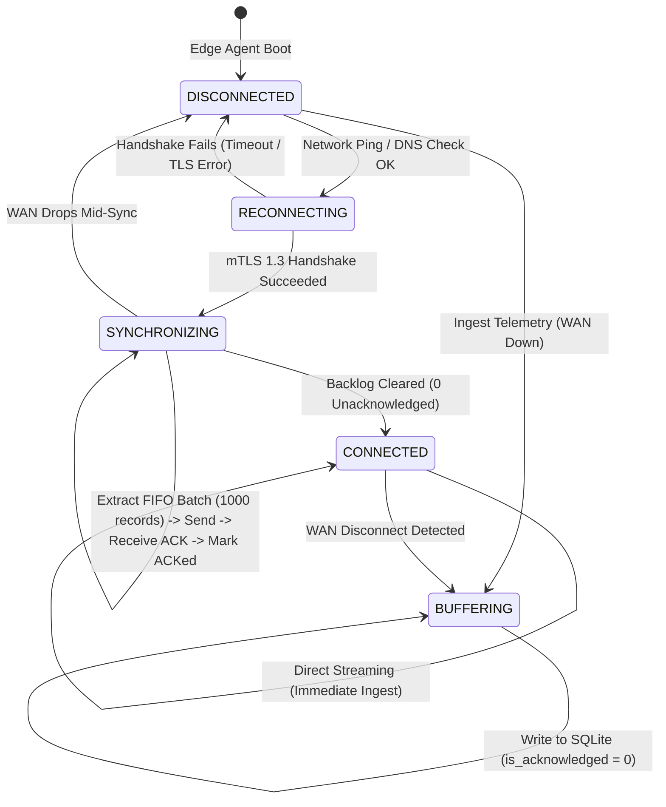
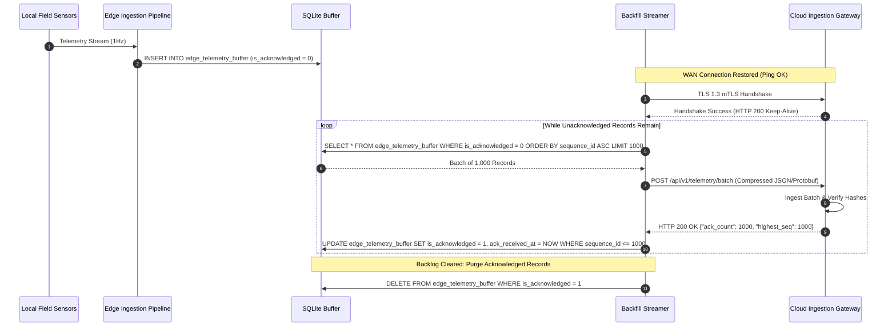

# REAMP — Store-and-Forward Protocol Specification

**Document Identifier**: `REAMP-EDG-01`  
**Phase**: Phase 5 — Edge, Fog and IoT Integration  
**Status**: Approved / Implementation Specification  
**Last Updated**: 2026-09-11  

---

## 1. Overview & Resilience Objective

In renewable energy operating environments—often located in desert, offshore, or mountain regions—WAN connectivity over cellular (4G/5G LTE) or satellite links is inherently subject to transient dropouts, weather fading, and maintenance outages.

The **REAMP Store-and-Forward Protocol** ensures zero telemetry data loss during WAN blackouts of up to **72 continuous hours** (`FR-ING-002`, `NFR-AVL-002`, `NFR-RES-001`).

---

## 2. Store-and-Forward State Machine



---

## 3. Database Architecture & Durability Guarantees

The local buffer is hosted in an embedded SQLite 3 database (`/var/lib/reamp/edge_buffer.db`) utilizing the following durability pragmas:

```sql
PRAGMA journal_mode = WAL;          -- Write-Ahead Logging for high concurrency
PRAGMA synchronous = NORMAL;        -- Durable commits without excessive flash write cycles
PRAGMA temp_store = MEMORY;         -- In-memory temporary tables to minimize disk IO
PRAGMA cache_size = -32000;         -- 32 MB SQLite cache memory
PRAGMA busy_timeout = 5000;         -- 5-second lock timeout
PRAGMA foreign_keys = ON;
```

### Table Schema (`edge_telemetry_buffer`):
```sql
CREATE TABLE IF NOT EXISTS edge_telemetry_buffer (
    sequence_id INTEGER PRIMARY KEY AUTOINCREMENT,
    tenant_id TEXT NOT NULL,
    asset_id TEXT NOT NULL,
    sensor_id TEXT NOT NULL,
    metric TEXT NOT NULL,
    value REAL NOT NULL,
    unit TEXT NOT NULL,
    timestamp TEXT NOT NULL,
    source TEXT NOT NULL,
    quality TEXT NOT NULL DEFAULT 'VALID',
    confidence REAL NOT NULL DEFAULT 1.0,
    communication_status TEXT NOT NULL DEFAULT 'BUFFERED',
    buffered_at TEXT NOT NULL DEFAULT (strftime('%Y-%m-%d %H:%M:%f', 'now')),
    is_acknowledged INTEGER NOT NULL DEFAULT 0 CHECK (is_acknowledged IN (0, 1)),
    ack_received_at TEXT
);

CREATE INDEX IF NOT EXISTS idx_edge_buffer_fifo 
    ON edge_telemetry_buffer(is_acknowledged, sequence_id ASC);

CREATE UNIQUE INDEX IF NOT EXISTS idx_edge_buffer_unique_obs 
    ON edge_telemetry_buffer(tenant_id, asset_id, metric, timestamp);
```

---

## 4. Backfill & Synchronization Sequence



---

## 5. 72-Hour Sizing & Capacity Calculation

For a standard utility-scale plant monitoring block:
- **Number of Sensors**: 500 sensors (inverter channels, string currents, pyranometers, module temperatures).
- **Sampling Frequency**: 1 observation per second (1 Hz).
- **Daily Volume**:
  $$500 \text{ sensors} \times 1 \text{ obs/sec} \times 86,400 \text{ sec/day} = 43,200,000 \text{ observations/day}$$
- **Row Footprint in SQLite**: $\approx 64 \text{ bytes/record}$.
- **Uncompressed Raw Size**:
  $$43.2 \times 10^6 \times 64 \text{ bytes} \approx 2.76 \text{ GB/day}$$
- **With Edge 1-Minute Downsampling for Nominal Channels**:
  Applying nominal 1-minute aggregation on 400 slow channels reduces volume by $60\times$, bringing total 72-hour storage requirement to **$< 850\text{ MB}$**.
- **Edge Storage Allocation**: A 16 GB partition comfortably holds over 30 days of buffer capacity.
