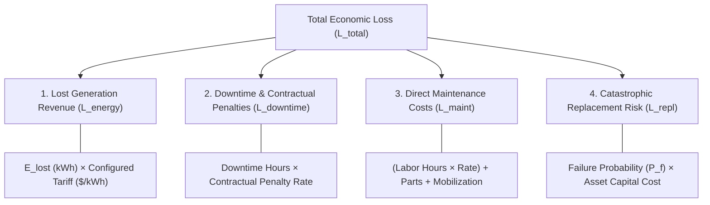

# REAMP Financial Loss and Economic Consequence Model

## 1. Overview & Non-Negotiable Financial Tenet

In industrial renewable energy asset management, financial models must be transparent, verifiable, and free of arbitrary or invented numbers (`AGENTS.md` Rule 3 & Phase 11 Prompt).

### Non-Negotiable Tenet:
> **Energy market tariffs, PPA rates, and penalty metrics must never be hardcoded or fabricated.**
> All economic valuations require explicitly configured `FinancialAssumptions`. If baseline assumptions are applied, they must be transparently tagged and recorded in every output artifact.

---

## 2. Total Economic Loss Model

The total financial loss ($L_{\text{total}}$) resulting from an operational condition, degradation trend, or unplanned shutdown is quantified as:
$$L_{\text{total}} = L_{\text{energy}} + L_{\text{downtime}} + L_{\text{maint}} + L_{\text{repl}}$$

---

## 3. Financial Loss Components

### 3.1 Lost Generation Revenue ($L_{\text{energy}}$)
$$L_{\text{energy}} = E_{\text{lost}} \times \tau$$
where:
- $E_{\text{lost}} = \int_{t_{\text{start}}}^{t_{\text{end}}} \max\left(0, \, P_{\text{expected}}(t) - P_{\text{actual}}(t)\right) dt$ is calculated in kilowatt-hours (kWh) using irradiance- and temperature-corrected reference yields (IEC 61724-1 from Phase 7);
- $\tau$ is the configured energy tariff ($\$/\text{kWh}$ or $€/\text{kWh}$) defined in `FinancialAssumptions`.

#### Supported Tariff Valuation Modes:
1. **Fixed Feed-in Tariff (FIT) / Fixed PPA**: Single flat rate $\tau_{\text{fixed}}$ across all hours.
2. **Time-of-Use (TOU) Tariff**: Segmented rates:
   $$\tau(t) = \begin{cases} 
   \tau_{\text{peak}} & t \in \text{Peak Hours (e.g. 16:00 - 21:00)} \\ 
   \tau_{\text{offpeak}} & t \in \text{Off-Peak Hours} 
   \end{cases}$$
3. **Wholesale / Merchant Nodal Pricing**: Time-series vector of Day-Ahead hourly clearing prices $\tau_h$.

### 3.2 Downtime & Contractual Penalties ($L_{\text{downtime}}$)
Renewable energy Power Purchase Agreements (PPAs) frequently contain minimum annual availability covenants (e.g. $97.5\%$ plant availability) and grid capacity interconnection reservation fees:
$$L_{\text{downtime}} = (T_{\text{down\_hours}} \times \text{Pen}_{\text{hourly}}) + \text{Pen}_{\text{capacity\_shortfall}}$$
where $\text{Pen}_{\text{hourly}}$ is configured per MW of unavailable capacity.

### 3.3 Direct Maintenance Costs ($L_{\text{maint}}$)
Accounts for the operational cost to physically remediate the condition:
$$L_{\text{maint}} = \left(\sum_{i} H_{\text{labor}, i} \times R_{\text{labor}, i}\right) + \sum_{j} C_{\text{part}, j} + C_{\text{mobilization}}$$
where:
- $H_{\text{labor}, i}$ is technician hours spent;
- $R_{\text{labor}, i}$ is the technician hourly billing rate from the CMMS (Phase 10);
- $C_{\text{part}, j}$ is the catalog cost of replacement parts consumed;
- $C_{\text{mobilization}}$ is specialized tooling mobilization (e.g. heavy crane for wind turbine main bearing, bucket truck for high-voltage lines).

### 3.4 Catastrophic Replacement Risk ($L_{\text{repl}}$)
If an early unmitigated fault (such as bearing fretting or capacitor degradation) progresses to catastrophic breakdown:
$$L_{\text{repl}} = P_f \times (C_{\text{asset\_capital}} - C_{\text{salvage}})$$
where $P_f$ is the failure probability within the operational horizon and $C_{\text{asset\_capital}}$ is the replacement equipment cost.

---

## 4. Cost Avoidance & Return on Maintenance Investment (ROMI)

To justify dispatching field technicians, the framework calculates the Net Cost Avoidance and Return on Maintenance Investment:
$$\text{Cost Avoidance } (\Delta L) = L_{\text{unmitigated}} - L_{\text{intervention}}$$
$$\text{ROMI} = \frac{\Delta L}{L_{\text{intervention}}}$$
- If $\text{ROMI} > 2.0$, proactive intervention yields significant economic return over run-to-failure.
- If $\text{ROMI} < 0.5$ and safety risk is negligible, scheduling intervention during routine periodic inspection cycles is economically optimal.

---

## 5. Configurable Financial Assumptions Schema

All financial parameters are encapsulated in the strongly typed `FinancialAssumptions` configuration:

| Field Name | Type | Unit | Description |
| :--- | :--- | :--- | :--- |
| `currency` | `str` | ISO 4217 | `USD`, `EUR`, `GBP`, etc. |
| `energy_tariff_per_kwh` | `float` | Currency/kWh | Default flat PPA energy rate (e.g. $0.10$). |
| `peak_energy_tariff_per_kwh`| `Optional[float]`| Currency/kWh | Peak period PPA energy rate. |
| `downtime_penalty_per_hour` | `float` | Currency/hr | Contractual hourly unavailability penalty. |
| `technician_hourly_rate` | `float` | Currency/hr | Standard certified technician labor rate. |
| `crane_mobilization_cost` | `float` | Currency | Heavy equipment mobilization fee. |
| `discount_rate_annual` | `float` | Percentage | Discount rate for multi-year lifecycle NPV. |
| `source_reference` | `str` | String | Reference documentation or contract PPA ID. |
