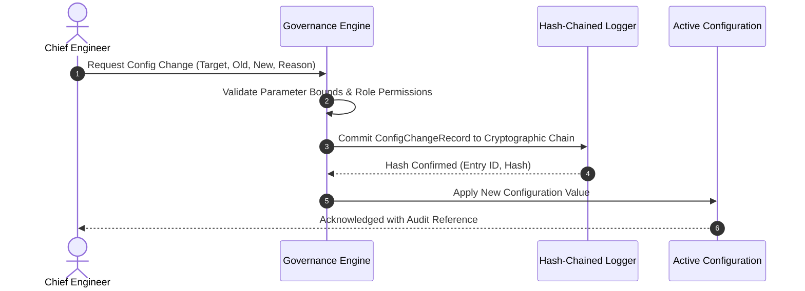

# REAMP Comprehensive Audit & Change Governance Model

## 1. Overview & Objectives

In safety-critical renewable asset management, audit logging is not merely a diagnostic debugging tool; it is a legal and regulatory requirement (NERC CIP-010, EU AI Act Article 12, ISO 27001 A.12.4).

The REAMP audit model captures four primary event categories:
1. **User Operational Actions**: Work order approvals, rejections, manual overrides, technician assignments;
2. **Configuration Modifications**: Safety trip thresholds, inverter curtailment settings, PPA tariffs, sensor calibration factors;
3. **Model & Algorithmic Deployments**: Deployment of new ML models, version updates, weight digest changes;
4. **Administrative & Security Events**: Role alterations, token revocations, policy updates, security incidents.

---

## 2. Configuration Change Governance (`ConfigChangeRecord`)

Every modification to system configuration follows a strict change control protocol:

| Field Name | Type | Description |
| :--- | :--- | :--- |
| `change_id` | `str` | Unique UUID (`CFG-2026-0042`). |
| `timestamp` | `str` | ISO 8601 UTC timestamp of modification. |
| `actor_id` | `str` | User ID or Service Principal initiating the change. |
| `tenant_id` | `str` | Organization / Tenant identifier. |
| `target_config` | `str` | Setting modified (e.g. `INVERTER_TRIP_TEMP_C`, `PPA_TARIFF_USD`). |
| `old_value` | `Any` | Previous active value. |
| `new_value` | `Any` | Newly approved value. |
| `approval_id` | `str` | Reference to human authorization record. |
| `justification` | `str` | Operational rationale for the change. |

---

## 3. Immutability & Hash Chaining

All audit records are committed to the tamper-evident hash chain established in Phase 13:
$$H_i = \text{SHA-256}(H_{i-1} \parallel \text{Entry}_i)$$
This guarantees mathematical non-repudiation. If an administrator or adversary attempts to retroactively alter an audit record or hide a misconfiguration, the entire downstream hash chain is broken and automated integrity scans immediately trigger a security incident.
