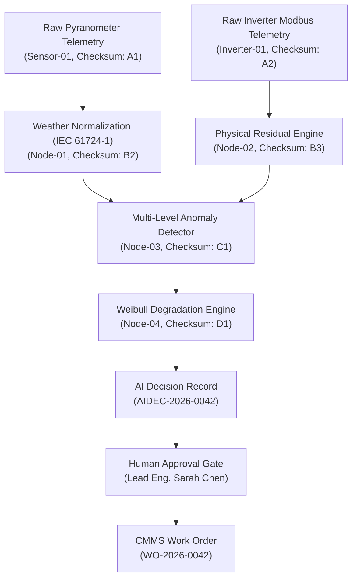

# REAMP Data Provenance Graph and Lineage Model

## 1. Overview & Lineage Architecture

Data provenance tracks the complete history, transformations, and custody transfers of data throughout its operational lifecycle.

In renewable energy systems, an algorithmic failure or wrong maintenance decision must be auditable backwards to the originating physical sensor measurements, intermediate data cleaning stages, and algorithm versions.

REAMP implements an immutable **Directed Acyclic Graph (DAG)** of provenance nodes:

---

## 2. Provenance Node Schema (`DataProvenanceNode`)

| Field Name | Type | Description |
| :--- | :--- | :--- |
| `node_id` | `str` | Unique node identifier (`PROV-2026-0088`). |
| `data_type` | `str` | Type of data (`RAW_TELEMETRY`, `NORMALIZED_RESIDUAL`, `ANOMALY_EVENT`, `AI_RECOMMENDATION`). |
| `source_id` | `str` | Originating asset, edge gateway, or algorithmic module ID. |
| `timestamp` | `str` | ISO 8601 UTC timestamp of creation. |
| `payload_checksum` | `str` | SHA-256 cryptographic digest of data content. |
| `parent_node_ids` | `List[str]` | Directed links to immediate ancestor provenance nodes. |
| `transformation_step`| `str` | Narrative description of mathematical or logical transformation applied. |

---

## 3. Bidirectional Provenance Traversal

The provenance engine supports two critical operational investigations:
1. **Backward Lineage Traversal (Root Cause & Audit)**:
   - Starting from a final `WorkOrder` or `AIDecisionRecord`, traverse upstream to identify the exact raw sensor telemetry and model versions that justified the intervention.
2. **Forward Impact Analysis (Sensor Fault Blast Radius)**:
   - When a sensor is discovered to have been decalibrated or faulty over a 3-day window, traverse downstream to identify all anomaly detections, risk profiles, and work orders corrupted by the bad data.
