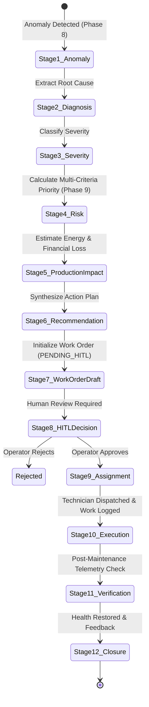

# REAMP 12-Stage Closed-Loop Maintenance Workflow

## 1. Lifecycle Overview

The REAMP maintenance workflow connects telemetry anomalies to field actions across 12 deterministic stages. Each transition is governed by strict validation rules, audit logging, and human authorization barriers.

---

## 2. Stage-by-Stage Operational Specifications

### Stage 1: Anomaly Ingestion
- **Trigger**: Telemetry anomaly generated by `reamp.anomaly` (Level 1 Rule, Level 2 Statistical EWMA/CUSUM, Level 3 Isolation Forest, or Level 4 Physical Residual).
- **Outputs**: `anomaly_id`, `metric`, `observed_value`, `expected_value`, `anomaly_score`, `timestamp`.

### Stage 2: Root Cause Diagnosis
- **Processing**: The diagnostic engine analyzes correlated telemetry channels (e.g. inverter temperatures, string DC currents, irradiance, wind speed) to isolate the subsystem and probable physical root cause.
- **Outputs**: `subsystem`, `probable_root_cause` (e.g. `INVERTER_COOLING_FAN_FAILURE`, `STRING_FUSE_BLOWN`, `BATTERY_CELL_IMBALANCE`).

### Stage 3: Severity Classification
- **Processing**: Evaluates operational risk tiers based on asset degradation severity:
  - `CRITICAL`: Immediate safety threat, thermal runaway hazard, or zero generation capability.
  - `MAJOR`: Significant power curtailment (> 20% capacity loss) or acute mechanical stress.
  - `MINOR`: Subsystem performance reduction (< 10%) or early degradation trend.
  - `INFORMATIONAL`: Sensor telemetry noise, non-critical communication jitter.

### Stage 4: Risk & Criticality Scoring
- **Processing**: Evaluates the multi-criteria risk priority engine from Phase 9 (`reamp.maintenance.priority.RiskPriorityScorer`).
- **Inputs**: Failure probability, asset criticality, production impact, safety hazard score, cost avoidance, spare availability.
- **Priority Tier**: Assigned as $P1\text{ (Critical)}$, $P2\text{ (High)}$, $P3\text{ (Medium)}$, or $P4\text{ (Low)}$.
- **Safety Override**: If safety hazard score $> 85.0$, immediately elevated to $P1$ regardless of other weights.

### Stage 5: Production & Financial Impact Quantification
- **Processing**: Calculates estimated hourly and daily energy loss:
  $$\text{Energy Loss Rate (kW)} = P_{\text{expected}} - P_{\text{actual}}$$
  $$\text{Financial Loss Rate (USD/hr)} = \text{Energy Loss Rate (kW)} \times \text{Tariff Rate (USD/kWh)}$$
- **Total Expected Avoided Cost**: Downtime $\times$ generation loss rate $+$ avoided catastrophic replacement expense.

### Stage 6: Maintenance Recommendation Synthesis
- **Processing**: Consolidates condition assessment, RUL prediction, priority score, required spare part SKUs, estimated labor hours, and skill certifications into a structured `MaintenanceRecommendation`.

### Stage 7: Work Order Draft Generation
- **Processing**: The workflow engine converts the incident and recommendation into a draft `WorkOrder`:
  - `status`: Automatically initialized to `PENDING_HITL_APPROVAL`.
  - `required_skill`: Set according to subsystem standards (e.g. `HIGH_VOLTAGE`, `INVERTER_SPECIALIST`).
  - `required_parts`: Reserved tentatively in inventory if available.
- **Guardrail**: The work order **cannot be dispatched or executed** while in this state.

### Stage 8: Human-in-the-Loop (HITL) Decision Gate
- **Governance**: A designated human operator (Site O&M Lead or Chief Engineer) must explicitly inspect the work order.
- **Actions**:
  - **Approve**: Operator confirms scope, parts, and priority. Status moves to `APPROVED`.
  - **Reject**: Operator records rejection reason (e.g. "Scheduled grid curtailment underway, false anomaly"). Work order moves to `REJECTED`, parts reservations are released, and incident is archived.
- **Security Enforcement**: Any attempt to dispatch or begin execution without prior approval raises an unhandled `PermissionError`.

### Stage 9: Technician Assignment & Inventory Reservation
- **Processing**: Matches required skill certifications and availability:
  - Validates that technician certifications contain `required_skill`.
  - Confirms technician `is_available == True`.
  - Reserves required spare part quantities from `SparePart` stock. If stock is insufficient, triggers urgent procurement alert.
- **Status**: Work order transitions to `DISPATCHED`.

### Stage 10: Field Execution & Maintenance Logging
- **Processing**: Technician conducts on-site repair, logs start/end timestamps, actual labor hours, actions taken, and parts consumed:
  - Deducts consumed parts from warehouse inventory stock.
  - Updates asset operational downtime minutes.
  - Sets work order status to `COMPLETED`.

### Stage 11: Post-Maintenance Verification
- **Verification Logic**:
  - Telemetry is streamed or simulated for the asset post-intervention.
  - Anomaly detection engine verifies that anomalous conditions have cleared.
  - Asset Health Index is re-evaluated by `reamp.health.deterministic` to confirm recovery (e.g. $HI \ge 90$).
- **Status**: Work order transitions to `VERIFIED`.

### Stage 12: Closure, Warranty Recovery & Closed-Loop Feedback
- **Processing**:
  - **Warranty Check**: Inspects active warranty contracts for the asset. If eligible, automatically generates a `WarrantyClaim` recovering labor and component expenses from the OEM.
  - **Closed-Loop Feedback**:
    - Updates asset maintenance history and operational MTBF (Mean Time Between Failures).
    - Resets component baseline wear counters.
    - Resolves and closes associated `Incident`.
    - Work order transitions to `CLOSED`.
  - **Traceability Chain**: Emits an immutable `TraceabilityRecord` linking:
    $$\text{Asset ID} \to \text{Anomaly ID} \to \text{HITL Decision} \to \text{Work Order ID} \to \text{Maintenance Log} \to \text{Verified Result}$$
