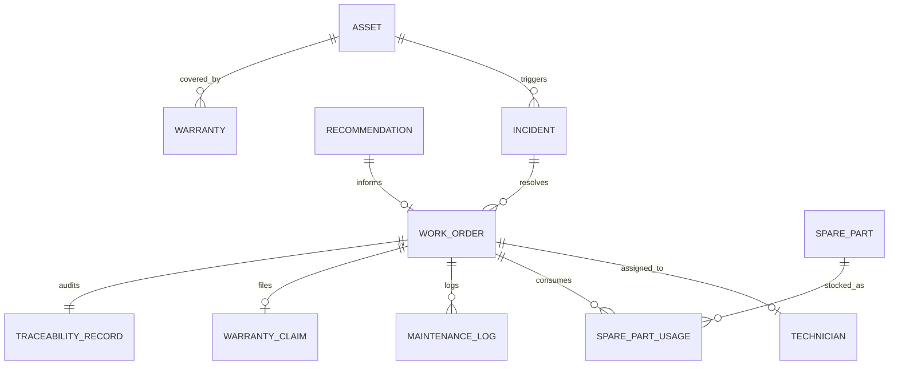

# REAMP Maintenance Work Order Data Model & Schema Specifications

## 1. Overview

This document specifies the data models, entity relationships, and schemas supporting the Operations & Maintenance (O&M) and CMMS workflow in REAMP.

All entities are designed for strong typing in Python (`reamp.cmms.models`), serializability to JSON/JSONB, relational persistence in PostgreSQL/TimescaleDB, and edge caching in SQLite.

---

## 2. Entity-Relationship Architecture

---

## 3. Entity Definitions & Schemas

### 3.1 Incident (`Incident`)
Represents an unhandled or actionable condition detected on an asset or subsystem.

| Field | Type | Description |
| :--- | :--- | :--- |
| `incident_id` | `str` | Unique identifier (e.g. `INC-20260911-001`). |
| `asset_id` | `str` | Foreign reference to asset ID. |
| `subsystem` | `str` | Affected subsystem (`INVERTER`, `STRINGS`, `BESS_RACK`, `WIND_GEARBOX`, etc.). |
| `anomaly_id` | `Optional[str]` | Link to the triggering anomaly detection event. |
| `severity` | `IncidentSeverity` | `CRITICAL`, `MAJOR`, `MINOR`, `INFORMATIONAL`. |
| `title` | `str` | Short descriptive title of the incident. |
| `description` | `str` | Detailed technical diagnostic narrative. |
| `detected_at` | `str` | ISO 8601 UTC timestamp of initial detection. |
| `status` | `IncidentStatus` | `OPEN`, `TRIAGED`, `WORK_ORDER_CREATED`, `RESOLVED`, `CLOSED`. |
| `resolved_at` | `Optional[str]` | Timestamp when resolution was verified. |

### 3.2 Work Order (`WorkOrder`)
The core physical maintenance contract instructing technicians on execution parameters.

| Field | Type | Description |
| :--- | :--- | :--- |
| `work_order_id` | `str` | Unique identifier (e.g. `WO-2026-0042`). |
| `incident_id` | `Optional[str]` | Reference to the originating incident. |
| `asset_id` | `str` | Target asset identifier. |
| `title` | `str` | Work order objective. |
| `maintenance_type` | `MaintenanceType` | `CORRECTIVE`, `PREVENTIVE`, `CONDITION_BASED`, `PREDICTIVE`, `INSPECTION`. |
| `priority` | `MaintenancePriority` | `P1_CRITICAL`, `P2_HIGH`, `P3_MEDIUM`, `P4_LOW`. |
| `status` | `WorkOrderStatus` | `DRAFT`, `PENDING_HITL_APPROVAL`, `APPROVED`, `DISPATCHED`, `IN_PROGRESS`, `COMPLETED`, `VERIFIED`, `CLOSED`, `REJECTED`. |
| `recommended_action`| `str` | Step-by-step physical task instructions. |
| `required_skill` | `str` | Required technician skill qualification (`HVAC_LEVEL_2`, `HIGH_VOLTAGE`, etc.). |
| `estimated_labor_hours`| `float` | Estimated technician hours required. |
| `required_parts` | `List[str]` | List of spare part SKU IDs required. |
| `assigned_technician_id`| `Optional[str]` | Assigned qualified technician identifier. |
| `created_at` | `str` | ISO 8601 creation timestamp. |
| `scheduled_start` | `Optional[str]` | Scheduled intervention start window. |
| `scheduled_end` | `Optional[str]` | Scheduled intervention completion window. |
| `actual_start` | `Optional[str]` | Actual physical work start timestamp. |
| `actual_end` | `Optional[str]` | Actual physical work completion timestamp. |
| `hitl_approval` | `Optional[HITLApprovalRecord]` | Mandatory human authorization audit record. |
| `traceability` | `Optional[TraceabilityRecord]` | Audit record connecting telemetry anomaly to resolution. |

### 3.3 Human-in-the-Loop Approval Record (`HITLApprovalRecord`)
Captures explicit human authorization decisions before dispatch.

| Field | Type | Description |
| :--- | :--- | :--- |
| `approved_by` | `str` | Username or ID of approving authority (e.g. `eng_lead_01`). |
| `decision` | `str` | `APPROVED` or `REJECTED`. |
| `decision_timestamp` | `str` | ISO 8601 UTC timestamp of decision. |
| `decision_notes` | `str` | Operational rationale or modifications approved. |
| `override_priority` | `Optional[str]` | Manual priority override if modified by human. |

### 3.4 Field Technician (`Technician`)
Profile of qualified O&M personnel available for maintenance dispatch.

| Field | Type | Description |
| :--- | :--- | :--- |
| `technician_id` | `str` | Unique ID (e.g. `TECH-014`). |
| `name` | `str` | Full name of technician. |
| `skills` | `List[str]` | Certifications & skills (`HIGH_VOLTAGE`, `INVERTER_SPECIALIST`, `BESS_SAFETY`). |
| `is_available` | `bool` | Current dispatch availability flag. |
| `hourly_rate_usd` | `float` | Labor billing rate for maintenance accounting. |
| `assigned_work_orders` | `List[str]` | Active work orders assigned to this technician. |

### 3.5 Spare Part & Inventory Record (`SparePart`)
Component spare inventory tracking warehouse stock and supply chains.

| Field | Type | Description |
| :--- | :--- | :--- |
| `part_sku` | `str` | Unique part number (e.g. `FAN-48V-DC-120MM`). |
| `name` | `str` | Descriptive part name. |
| `category` | `str` | Subsystem category (`ELECTRICAL`, `COOLING`, `MECHANICAL`, `SENSOR`). |
| `quantity_on_hand` | `int` | Available unreserved warehouse stock. |
| `quantity_reserved`| `int` | Reserved stock allocated to approved work orders. |
| `reorder_threshold`| `int` | Minimum safety stock before reorder notification. |
| `unit_cost_usd` | `float` | Cost per part. |
| `lead_time_days` | `int` | Supplier procurement lead time in days. |

### 3.6 Maintenance Execution Log (`MaintenanceLog`)
Audit log of physical work executed on site.

| Field | Type | Description |
| :--- | :--- | :--- |
| `log_id` | `str` | Unique maintenance log identifier. |
| `work_order_id` | `str` | Associated work order ID. |
| `asset_id` | `str` | Target asset ID. |
| `technician_id` | `str` | Technician executing the work. |
| `performed_at` | `str` | ISO 8601 timestamp. |
| `labor_hours_actual` | `float` | Actual hours spent. |
| `actions_taken` | `str` | Narrative of physical operations performed. |
| `parts_replaced` | `List[Dict[str, Any]]` | List of parts consumed with quantities. |
| `root_cause_found` | `str` | As-found failure mode or physical condition. |
| `downtime_minutes` | `float` | Total duration asset was offline during maintenance. |

### 3.7 Asset Warranty & Claim Record (`Warranty`, `WarrantyClaim`)
Warranty contract tracking to ensure supplier cost recovery for defective components.

| Field | Type | Description |
| :--- | :--- | :--- |
| `warranty_id` | `str` | Warranty contract identifier. |
| `asset_id` | `str` | Target asset ID. |
| `subsystem` | `str` | Subsystem covered. |
| `oem_vendor` | `str` | OEM vendor name (e.g. `SMA`, `Sungrow`, `Vestas`). |
| `warranty_start` | `str` | Coverage start date (ISO 8601). |
| `warranty_end` | `str` | Coverage expiration date (ISO 8601). |
| `terms` | `str` | Coverage terms (e.g. "Full parts and labor replacement"). |

When an eligible corrective maintenance log is completed on an active warranted asset, a `WarrantyClaim` is generated:
- `claim_id`: Unique claim identifier.
- `warranty_id`: Associated contract.
- `work_order_id`: Work order documenting the failure and repair.
- `claimed_amount_usd`: Total parts cost + labor cost.
- `status`: `DRAFT`, `SUBMITTED`, `REIMBURSED`, `DENIED`.

### 3.8 Traceability Record (`TraceabilityRecord`)
The immutable chain satisfying the Phase 10 Quality Gate.

| Field | Type | Description |
| :--- | :--- | :--- |
| `traceability_id` | `str` | Unique traceability record identifier. |
| `asset_id` | `str` | Asset identifier. |
| `anomaly_id` | `Optional[str]` | Triggering anomaly ID and detector model. |
| `diagnosis` | `str` | Root-cause classification and severity. |
| `decision_id` | `str` | HITL approval ID and authorizer identity. |
| `work_order_id` | `str` | Generated work order ID. |
| `action_id` | `str` | Executed maintenance log ID and technician ID. |
| `result` | `str` | Verification result (health score delta, anomaly resolved status). |
| `created_at` | `str` | Timestamp of complete closed-loop record creation. |
