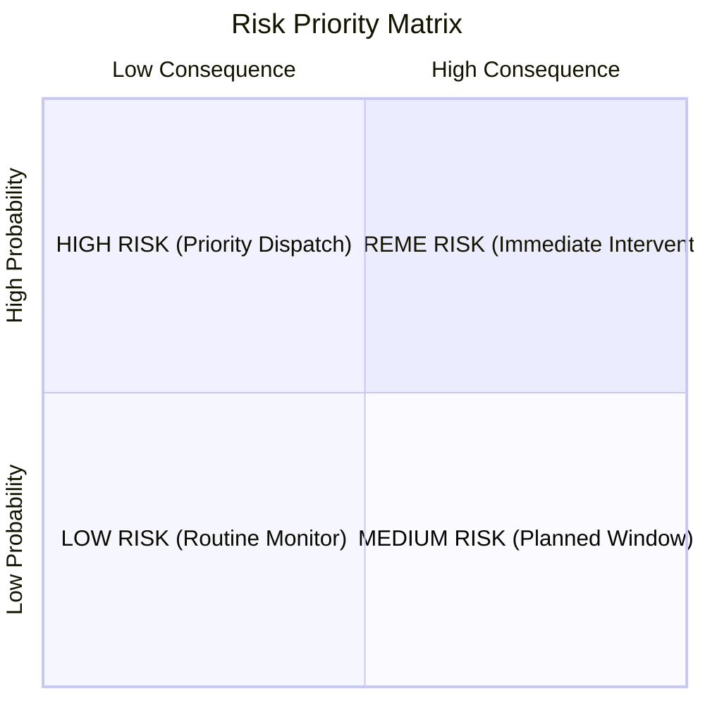

# REAMP Quantitative Risk Model Specification

## 1. Mathematical Formulation

The REAMP risk model evaluates operational risk for renewable energy assets using the classical probabilistic risk assessment framework:
$$\text{Risk Score } R = P \times C$$
where:
- $P \in [0.0, 1.0]$ is the calibrated failure probability over an operational time horizon $\Delta t$;
- $C \in [0.0, 100.0]$ is the multi-dimensional consequence score;
- $R \in [0.0, 100.0]$ is the continuous composite risk score.

---

## 2. Probability Quantification ($P$)

Failure probability is evaluated from multi-source condition streams:

### 2.1 Weibull Reliability Trajectory (Predictive Mode)
When health degradation history is available ($N \ge 5$ observations), conditional failure probability over horizon $\Delta t$ is computed via the two-parameter Weibull CDF:
$$P_{\text{weibull}}(t, \Delta t) = 1 - \exp\left( -\left[\frac{t + \Delta t}{\eta}\right]^\beta + \left[\frac{t}{\eta}\right]^\beta \right)$$
where $\beta$ is the shape parameter ($\beta > 1$ represents wear-out degradation) and $\eta$ is the characteristic life scale parameter.

### 2.2 Anomaly Severity & Frequency (Reactive & CBM Mode)
When anomalous events occur without long-term degradation trajectories:
$$P_{\text{anomaly}} = \min\left(1.0, \, s_{\text{anomaly}} \times \left(1.0 + 0.1 \times \min(n_{\text{events}}, 5)\right)\right)$$
where $s_{\text{anomaly}} \in [0, 1]$ is the normalized anomaly score from `reamp.anomaly` and $n_{\text{events}}$ is the count of recurring anomalies within the last 24 hours.

### 2.3 Effective Failure Probability ($P$)
$$P = \max(P_{\text{weibull}}, P_{\text{anomaly}}) \times \text{Confidence}$$
If telemetry confidence is degraded (e.g. communication jitter or sensor noise), probability is tempered by confidence $\text{Conf} \in [0.5, 1.0]$ to prevent unwarranted false precision (`AGENTS.md` Rule 8).

---

## 3. Consequence Formulation ($C$)

The composite consequence score is computed as:
$$C = w_{\text{prod}} S_{\text{prod}} + w_{\text{crit}} S_{\text{crit}} + w_{\text{safe}} S_{\text{safe}} + w_{\text{maint}} S_{\text{maint}}$$
with default baseline weights:
$$\sum w = 0.35 + 0.25 + 0.25 + 0.15 = 1.00$$

### 3.1 Production Impact Score ($S_{\text{prod}} \in [0, 100]$)
Measures direct generation deficit relative to asset nameplate rating $P_{\text{rated}}$:
$$S_{\text{prod}} = \min\left(100.0, \, \frac{E_{\text{lost\_24h}}}{P_{\text{rated}} \times 8.0 \text{ equivalent peak sun/wind hours}} \times 100.0\right)$$

### 3.2 Asset Criticality Score ($S_{\text{crit}} \in [0, 100]$)
Reflects topological single-point-of-failure severity within the plant architecture:

| Criticality Tier | Asset Types | $S_{\text{crit}}$ Score | Operational Impact |
| :--- | :--- | :--- | :--- |
| **Tier 1 (Critical)** | Main Substation, Interconnect Transformer, Central BESS Inverter | **$100.0$** | Single failure halts 100% of facility export. |
| **Tier 2 (Major)** | String Inverter, Individual Wind Turbine, BESS Rack | **$75.0$** | Failure curtails major generation block ($1\text{--}10\%$). |
| **Tier 3 (Balance of Plant)**| Combiner Box, PV Tracker Motor, Weather Station, Individual String | **$25.0$** | Minor localized generation loss ($< 0.5\%$). |

### 3.3 Safety Consequence Score ($S_{\text{safe}} \in [0, 100]$)
Evaluates physical risk to human personnel, environment, and physical plant integrity:
- **`NEGLIGIBLE` ($0.0$)**: Benign electrical drift, no arc or thermal risk.
- **`MODERATE` ($30.0$)**: Elevated operating temperature within secondary safety margins.
- **`SEVERE` ($70.0$)**: Severe overheating, insulation breakdown, mechanical imbalance.
- **`CATASTROPHIC` ($100.0$)**: Thermal runaway in BESS, active electrical arc hazard, mechanical blade flutter.

### 3.4 Maintenance Consequence Score ($S_{\text{maint}} \in [0, 100]$)
Accounts for logistics lead time, crane mobilization, and parts availability:
$$S_{\text{maint}} = \min\left(100.0, \, 20.0 \times \text{LeadTimeWeeks} + 30.0 \times \mathbb{I}_{\text{SpecialToolingRequired}}\right)$$

---

## 4. Multi-Tier Risk Matrix & Tiers

Composite risk $R$ maps into four standard operational tiers:

| Risk Tier | Score Range | Operational Directive & SLA |
| :--- | :--- | :--- |
| **`EXTREME`** | $R \ge 75.0$ **OR** $S_{\text{safe}} \ge 85.0$ | **Emergency Shutdown / Immediate Intervention (< 4 hours)** |
| **`HIGH`** | $50.0 \le R < 75.0$ | **Urgent Maintenance Dispatch (< 24 to 48 hours)** |
| **`MEDIUM`** | $25.0 \le R < 50.0$ | **Scheduled Remediation (< 14 days)** |
| **`LOW`** | $R < 25.0$ | **Routine Monitoring / Deferrable (< 60 days)** |

### Safety Override Guarantee
$$\text{If } S_{\text{safe}} \ge 85.0 \implies \text{Risk Tier} \equiv \textbf{EXTREME}$$
regardless of whether the failure probability is low or the asset has small generation capacity.
