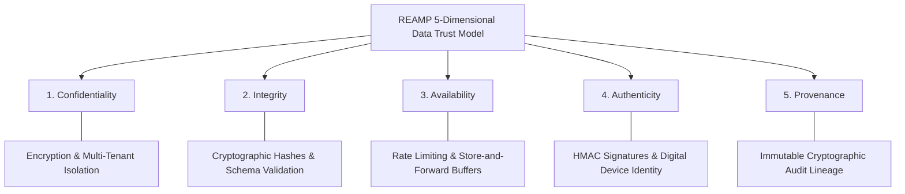

# REAMP Data Trust Taxonomy & Provenance Model

## 1. Overview & Problem Definition

In conventional software engineering, data security is frequently summarized under the CIA triad (Confidentiality, Integrity, Availability). In critical cyber-physical renewable energy asset intelligence, CIA alone is insufficient.

When an AI algorithm diagnoses a battery cell thermal runaway or schedules a high-voltage transformer inspection, operators must verify not only that the telemetry was uncorrupted, but that it originated from an **authentic physical device** and maintains an unbroken, verifiable **lineage of custody (Provenance)**.

REAMP formally defines and enforces five distinct dimensions of Data Trust:

---

## 2. Dimensional Definitions & Enforcements

### 2.1 Confidentiality
- **Definition**: Ensuring telemetry, commercial PPA tariffs, grid connection agreements, and operational failure records are inaccessible to unauthorized entities or competing tenants.
- **Technical Enforcement**:
  - **In Transit**: Mandatory TLS 1.3 encryption for all external network hops.
  - **At Rest**: AES-256-GCM encryption for database disks and edge persistent SQLite caches.
  - **Multi-Tenant Isolation**: Row Level Security (RLS) policies in PostgreSQL/TimescaleDB and tenant-bound ABAC tokens.

### 2.2 Integrity
- **Definition**: Guaranteeing that data cannot be modified, corrupted, or silently truncated in transit or storage without immediate mathematical detection.
- **Technical Enforcement**:
  - **Payload Hashes**: SHA-256 digests computed over all telemetry and configuration payloads.
  - **Tamper-Evident Audit Logging**: Hash-chained log sequences ($H_i = \text{SHA256}(H_{i-1} \parallel \text{Entry}_i)$) where modifying any historical record invalidates all subsequent hashes.
  - **Schema Validation**: Strict dataclass validation preventing out-of-range or malformed payloads.

### 2.3 Availability
- **Definition**: Ensuring critical telemetry, health intelligence, and safety control channels remain operational during network disruptions, hardware faults, or malicious volumetric attacks.
- **Technical Enforcement**:
  - **Edge Store-and-Forward**: Persistent local SQLite buffers (Phase 5) preserve telemetry during WAN blackouts and re-synchronize sequentially upon link restoration.
  - **Token-Bucket Rate Limiting**: Ingress traffic shaping protects backend databases from resource exhaustion DoS attacks.
  - **Autonomous Fail-Safe**: Edge devices default to safe local operational states if communication with supervisory cloud twins is lost.

### 2.4 Authenticity
- **Definition**: Verifying with mathematical certainty the true physical identity of the entity generating an event or data payload.
- **Technical Enforcement**:
  - **HMAC-SHA256 Device Signatures**: Each edge gateway and inverter RTU signs packets using a secure device-specific cryptographic secret.
  - **Mutual TLS (mTLS)**: Hardware X.509 certificate exchange verifying device identity at the transport layer.

### 2.5 Provenance
- **Definition**: An unbroken, immutable historical chain documenting the exact origin, intermediate processing steps, algorithmic models, and human authorization decisions associated with any operational asset condition.
- **Technical Enforcement**:
  - **Lineage Verification (Quality Gate)**:
    $$\text{Physical Sensor} \to \text{Signed Packet} \to \text{Anomaly Event} \to \text{HITL Decision} \to \text{Work Order} \to \text{Verified Outcome}$$
  - Every work order, risk assessment, and predictive recommendation explicitly references parent event UUIDs, model version digests, and authorizer identities.
